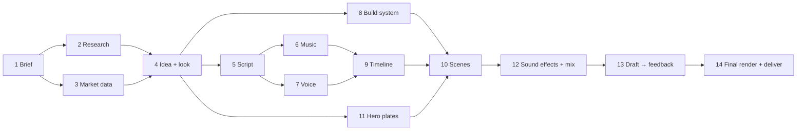

# Quick guide: making a launch film like Superstar

One file with everything you need: what was done, the step-by-step process, the master prompt and the prompts for each sub-agent.
For the deep detail behind any step, see the other files in this folder.

---

## 1. What was done (summary)

| Area | Result |
|---|---|
| **Film** | 97 s, 9:16 portrait, 1080×1920, 60 fps → `superstar/deliverables/superstar-launch-9x16.mp4` |
| **Story** | "This market whipsaws and punishes whoever picks one side. Superstar trades both sides, and knows when to sit out." |
| **Data** | Live market numbers from the Hyblock MCP and the Hyperliquid API: 89 direction changes, $542M longs / $616M shorts liquidated in 30 days |
| **Look** | Deploy design system held strictly: Soft Black → Gray/White, Blue Glow ~30 %, one turquoise accent per scene |
| **Picture** | 13 scenes built in code (Remotion 2D + three.js 3D), plus 2 AI hero plates (Kling 3 Pro) graded to the brand colours |
| **Voice** | ElevenLabs narration (voice "Signal"), synced word by word to the animation |
| **Music** | ElevenLabs score at 120 BPM, edited in whole bars to hit the cuts (freeze at 20 s, reveal at 22 s, drop at 58 s, final hit at 88 s) |
| **Sound effects** | ~400 sound cues taken from the animation code; ElevenLabs SFX + custom synth sounds tuned to the music's key |
| **Mix** | −14 LUFS, −1 dBTP, music ducks under the voice |
| **Review changes** | Less text on screen; the "USDC in / USDC out" beat removed |
| **Docs** | Full playbook in `superstar/playbook/` (process, prompts, decisions, runbook) |

**The crew**

| Role | Job |
|---|---|
| Director (lead agent) | Idea, look, timeline, hero scenes, sound mix, render, quality checks, client contact |
| Researcher | Product facts, brand assets, compliance wording |
| Quant Analyst | Live market data and the volatility story |
| Script Writer | Narration lines tied to sources (done by the Director) |
| SFX Designer | Sound palette (generated + synthesised) |
| Motion Designers (×2) | Built the middle scenes in parallel |

---

## 2. Step-by-step process



| # | Step | What you do | Output |
|---|---|---|---|
| 1 | **Brief** | Get the format, length, docs links, logo files, colours and fonts from the client | Branch + folders |
| 2 | **Research** | A sub-agent reads the product docs and website and quotes every claim with its link | `docs/00-product-and-brand.md` |
| 3 | **Market data** | A sub-agent pulls live data and finds the story in the numbers | `docs/03-quant-brief.md`, `data/market.json` |
| 4 | **Idea + look** | Pick **one idea** (here, "both sides") and a visual rule (dark = market, light = Deploy). Write the scene list and the colour rules. | Treatment, colour system |
| 5 | **Script** | One short line per scene. Each line is either a fact or a product rule, and every line has a source. | Script + claim map |
| 6 | **Music** | Prompt the score with timestamps for each act (stop, impact, groove, breakdown, final hit). Make 3 takes, pick one, then measure its tempo and key. | Score |
| 7 | **Voice** | Try 3 voices, pick one, generate the full read, get word timings with Whisper, and place each line on the film timeline | `vo.json` (every word with a frame) |
| 8 | **Build system** | Set up Remotion: theme (colours, fonts, easing), helpers, shared components, the 3D star, token icons | `video/src/` |
| 9 | **Timeline** | Set scene start and end times on music bars, and link animations to narration words (`wordF`) | `timeline.ts` |
| 10 | **Scenes** | The Director builds the hero scenes and two sub-agents build the rest in parallel. Each scene exports its sound cues. Check contact sheets of still frames. | 13 scenes |
| 11 | **Hero plates** | At most 2 AI shots for atmosphere only. Grade them to the brand colours and hand off to live 3D. | 2 graded plates |
| 12 | **Sound + mix** | Generate and synthesise SFX, measure harshness, put a sound on every cue, duck the music under the voice, master to −14 LUFS | `mix.wav` |
| 13 | **Draft** | Render a half-size draft and show the client | Feedback |
| 14 | **Final** | Full render, check loudness and frames, commit, push, share the link | Final MP4 |

**Golden rules:** one idea · numbers are the text, labels ≤ 3 words · every number has a source · brand colours only · code for information, AI video for atmosphere · animation timing comes from the narration words · sound cues come from the animation code · edit music in whole bars.

---

## 3. Master prompt

Paste this to the lead agent to start a new film. Replace the `<…>` fields.

````text
You are the DIRECTOR of an expert creative crew. Make an award-level, portfolio-grade launch film for <PRODUCT> by <COMPANY>.

FORMAT: <9:16 portrait, 1080×1920, 60 fps>, at least <90> seconds. Create a branch named "<branch-name>". Do not stop until the video is complete.

SOURCES: product docs <URL1>, <URL2>. Brand: official logo SVGs, colour system and fonts I will provide; follow the design system strictly.
DATA: use <MCP / API> to pull live data and build the story on real, sourced numbers.
STORY GOAL: position <PRODUCT> as the best answer to <CURRENT SITUATION / MARKET CONDITION>.

CREW (spawn sub-agents, run independent work in parallel, you own the vision and every final decision):
1. Researcher: product facts, compliance wording, brand assets.
2. Quant/Data Analyst: live data, the story in the numbers, chart-ready JSON.
3. Script Writer (you): short narration lines, each tied to a source.
4. Motion Designers: build scenes in Remotion (2D) + React Three Fiber (3D) in parallel, on a shared system you build first.
5. SFX/Audio Designer: score, narration and SFX with ElevenLabs, plus tuned synth sounds.

RULES:
- One clear idea. Three acts. Two planned silences for impact.
- Highly visual motion animation: little on-screen text (labels ≤ 3 words), numbers are the text, no static frames.
- Brand colours and fonts only; one accent element per scene; accurate token logos from icon libraries only.
- Use at most 1–2 AI-generated hero plates; everything else is code-driven motion.
- Every number and claim must be sourced; performance figures labelled "simulated"; no promised returns.
- Sync animation to narration words and music bars. Every scene exports its sound cues; the mix is built from those cues.
- SFX must be crisp, pleasant, tuned to the music's key, and attached to on-screen motion.
- Mix at -14 LUFS / -1 dBTP with the music ducked under the voice.
- QA with contact sheets at every sync point and scene join. Show me a draft before the final render.
- Commit and push at each milestone. Never commit licensed fonts.

DELIVER: the final MP4 in /deliverables, docs for every stage, and a short summary of what was done.
````

---

## 4. Sub-agent prompts

Short, reusable versions. The exact prompts used for this film are in [11-prompt-library.md](11-prompt-library.md).

### 4.1 Researcher

````text
You are the BRAND & PRODUCT RESEARCHER for a launch film about <PRODUCT>.
1. Fetch these pages and capture claims, numbers and wording VERBATIM with their URLs: <URLs>.
2. From the website (<URL>) find and download: logo SVG/PNG files, favicon, font files and names, brand colours, taglines, hero copy, product images.
   Save to assets/brand/ and assets/fonts/. Note each font's licence.
3. Write docs/00-product-and-brand.md with: Product facts (quotes + URLs), Risks & compliance language we must respect, Brand (files, fonts, colours, tone of voice).
Do not commit. Reply with: key claims, compliance must-dos, files saved, tagline and voice.
````

### 4.2 Quant / Data Analyst

````text
You are the QUANT ANALYST on a creative crew making a <LEN>-second film for <PRODUCT>. Today is <DATE>.
Goal: measure the CURRENT market with real data and write the story the film will be built on.
Product facts (the only claims we can make): <bullets>.
Tools: <MCP tools, how to load them, one known-good call, gotchas such as units and limits>.
Gather: price history (<windows>), volatility, leverage/liquidations, positioning, order flow.
Counting rules: closed candles only; state window, venue and timestamp for every number.
Deliver:
 A) data/market.json, chart-ready and compact, with asOf.
 B) docs/quant-brief.md: snapshot table (value + source + time), "The regime", "The narrative",
    "Why this favours <PRODUCT>" (market property → product feature), film-ready facts, 3 opening hooks, caveats.
Be honest; don't force a story the data doesn't support. Reply with the 5 strongest numbers and the regime in one sentence.
````

### 4.3 Script Writer

````text
You are the SCRIPT WRITER. Using docs/quant-brief.md and docs/00-product-and-brand.md, write the narration for a <LEN>-second film.
Voice: calm, exact, confident, not hype. About <N> words. One short line per scene beat.
Each line is a sourced fact or a product rule; prefer the product's own phrasing.
Leave the music's big moments clear (<times>). Avoid lines that need insider context to understand.
Output docs/script.md: table of film time | narration | on-screen words (key noun or number only), plus a claim map (line → source).
````

### 4.4 Motion Designer (one per group of scenes)

````text
You are a MOTION DESIGNER on the crew. Build scenes <IDS> in video/src/scenes/.
First read docs/motion-brief.md (follow it exactly), the colour system, treatment and script; skim theme.ts, ui.tsx, timeline.ts and the data files.
You own only scenes/<IDS>.tsx and components/<ID>_*.tsx. Everything else is read-only. Don't commit.

<ID> · "<title>": film <a>–<b> s, <n> frames, ground <colour>.
Narration: <line> at <time>. Land key motions on these words with wordF('<Lxx>','<word>').
Design: <what the viewer sees, in order>. Blue ≈ 30 % of the frame; exactly one accent element: <element>.
Highly visual: labels ≤ 3 words, numbers are the text, nothing static for more than 0.5 s.
Exit: <clean exit | match cut into the next scene>.

Export T (frame constants) and CUES (sound cues at the frame each motion lands; add dur=<frames> for long sounds).
QA: `npx tsc --noEmit` passes; render a contact sheet of ≥10 frames (first, last, every sync point); fix what you see.
Report: files, what lands on which word, any issues with shared files.
````

### 4.5 SFX / Audio Designer

````text
You are the SFX DESIGNER. Build a crisp, pleasant, tactile sound palette (premium keynote style: never harsh, never cartoonish).
Music: <BPM> BPM, key <measured key>. Tonal sounds use only the root, fifth and second of that key.
Visual moments to sound: <list: whooshes, impacts, UI clicks, locks, ticks, count-ups, reveals, logo>.
1. ElevenLabs Sound Effects (flow <flow_id>): describe the SOUND ("<size> <material> <action>, clean, dry, close-mic, no reverb tail"),
   short durations for one-shots, prompt_influence 0.5–0.7, 2 takes each. Download every result with a clear file name.
2. Python synth bank (48 kHz): tuned blips, soft ticks, pops, pings, a signature confirm chord, ratchets, count-up tick trains, grain cascades.
3. Measure every take (onset, peak, brightness, 2–5 kHz harshness) and recommend the best take per sound.
Deliver audio/src/sfx/ and an analysis table.
````

### 4.6 Music + Voice (generation prompts)

````text
SCORE: Instrumental <genre> score in <key> at a steady <BPM> BPM, <production reference>. Opens <mood>, builds to an abrupt full stop at
about <t1> s. After a breath of silence, <reveal> with a deep impact, then a confident groove that adds a layer every eight seconds.
Around <t2> s it breaks down to almost nothing, then rebuilds into a full peak from <a> to <b> s, ending on one big final hit at about <t3> s
with a long decaying tail. No vocals.

VOICE: <full script, sentences separated by "…" for breaths, numbers spelled out as they should be spoken>
````

### 4.7 Hero plate (AI video)

````text
<Medium> on <background matching the brand ground exactly>. <Subject> <action>, then <final state>. The camera <move>, <lens/depth of field>.
<Lighting>. Minimal, precise, premium, photoreal materials, subtle film grain.
NEGATIVE: text, letters, numbers, logos, watermark, neon, rainbow colors, <off-brand colours>, lens flare, bloom, glow, people, hands, warped geometry, flicker, morphing
````
