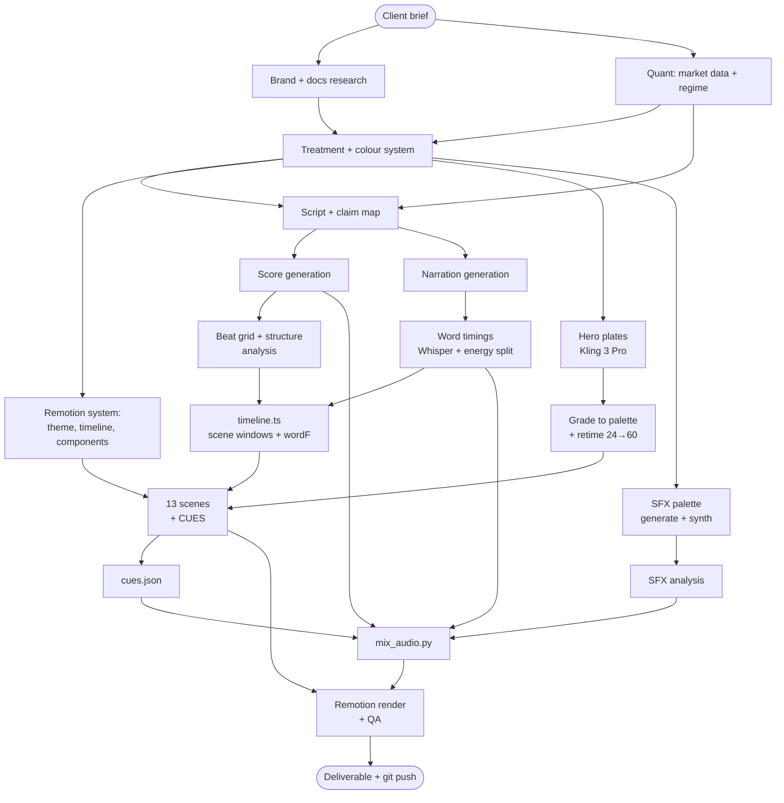
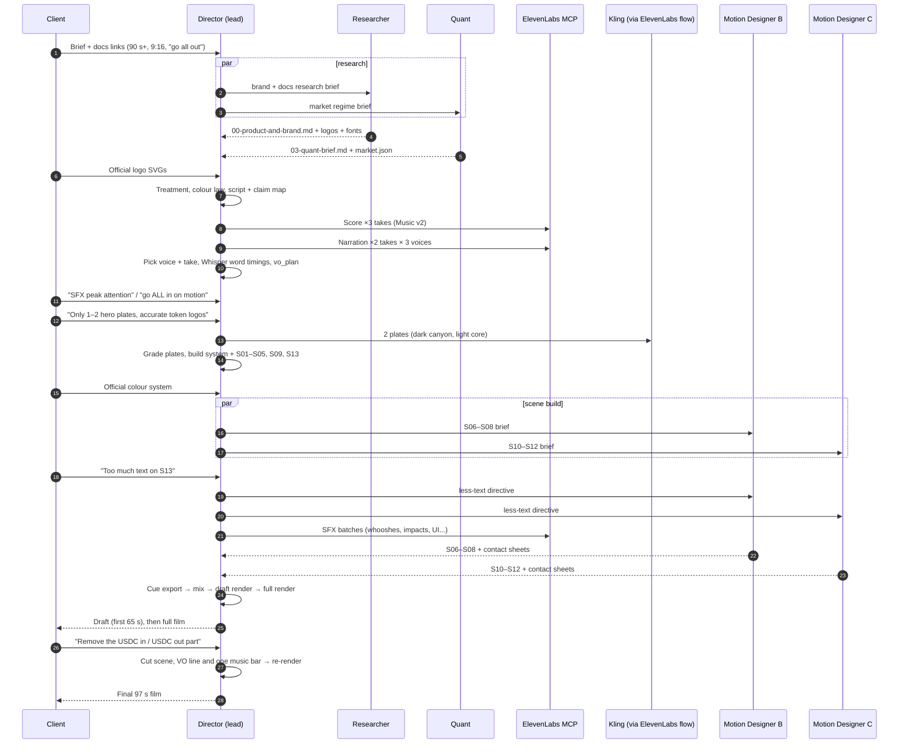
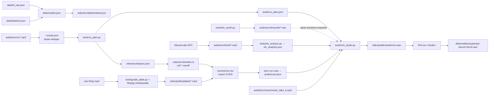

# 01 · Pipeline overview

## 1. Phases at a glance

| Phase | Goal | Owner (crew role) | Key outputs | Gate to move on |
|---|---|---|---|---|
| 0. Intake | Understand brief, format, audience, constraints | Director | Brief summary, branch `deploy-super-star-launch-video` | Format + length + "must-haves" confirmed |
| 1. Research | Product facts, compliance language, brand assets | Brand/Docs Researcher | `docs/00-product-and-brand.md`, `assets/brand/*`, fonts | Every claim we may use is quoted with a URL |
| 2. Market intel | Current regime, numbers for the story | Quant Analyst | `docs/03-quant-brief.md`, `data/market.json` | Numbers reproducible from raw data |
| 3. Treatment | Concept, look, structure, sound idea | Director | `docs/01-director-treatment.md`, `docs/02-color-system.md` | One idea that the whole film serves |
| 4. Script | VO lines + on-screen words + claim map | Script Writer (with Quant + Director) | `docs/04-script.md` | Every line maps to a source |
| 5. Score | Music with a structure that matches the acts | SFX/Audio (ElevenLabs) | `audio/src/music/*.mp3` | Take chosen; downbeats measured |
| 6. Narration | Locked read, word timings | Script Writer + Audio | `audio/src/vo/*`, `audio/vo_plan.json`, `video/src/data/vo.json` | Every line placed on the timeline |
| 7. Motion system | Remotion project, theme, timeline, components | Director | `video/src/{theme,timeline,anim}.ts`, `components/*` | Components render correctly in stills |
| 8. Hero plates | 1–2 generated shots, graded | Director | `video/public/plates/*.mp4` | Plate ground matches brand ground |
| 9. Scenes | 13 scenes, each with its `CUES` | Director + 2 Motion Designers (parallel) | `video/src/scenes/S01–S13.tsx` | Contact sheet approved per scene |
| 10. SFX palette | Generated + synthesised sounds, analysed | SFX Designer / Director | `audio/src/sfx/**`, `audio/sfx_analysis.json` | Harshness measured, best takes picked |
| 11. Mix | Music edit, VO, SFX spotting, ducking, master | Director | `tools/mix_audio.py` → `video/public/audio/mix.wav` | −14 LUFS, −1 dBTP, report checked |
| 12. Render + QA | Final MP4 | Director | `deliverables/*.mp4` | Stills at every join, loudness check |
| 13. Review rounds | Client feedback applied | Director | New commits + re-render | Client sign-off |

## 2. Dependency graph

Arrows mean "must exist before". Everything in the same column can run in parallel.

## 3. How the build actually ran (sequence)

## 4. Film timeline (final cut)

60 fps; the score is 120 BPM, so 1 beat = 30 frames and 1 bar = 120 frames = 2.0 s.

```mermaid
gantt
    dateFormat ss
    axisFormat %S
    title Superstar film: 97 s (seconds)
    section Act I · the market (dark)
    S01 Whipsaw · 89 flips        :a1, 00, 8s
    S02 Liquidations 3D           :a2, after a1, 7.5s
    S03 Pick one side → freeze    :a3, after a2, 6.5s
    section Act II · the agent (light)
    S04 Reveal (plate → 3D star)  :b1, 22, 4s
    S05 Every four hours          :b2, after b1, 8s
    S06 01 Read                   :b3, after b2, 8s
    S07 02 Build a picture        :b4, after b3, 8s
    S08 03 Argue → 04 Choose      :b5, after b4, 8s
    S09 NO TRADE · 1,350/2,298    :b6, after b5, 7.5s
    section Act III · proof + close
    S10 Risk first                :c1, after b6, 10.5s
    S11 Backtest proof            :c2, after c1, 8s
    S12 Where it runs             :c3, after c2, 4s
    S13 End card                  :c4, after c3, 9s
```

| Scene | Frames | Seconds | Ground | Music section | Key sync point |
|---|---|---|---|---|---|
| S01 | 0–480 | 0–8 | Soft Black | sparse intro | 89 tick sounds, one per direction change |
| S02 | 480–930 | 8–15.5 | Soft Black | tension build | $542M / $616M counters |
| S03 | 930–1320 | 15.5–22 | Soft Black → gray | stop at 20.0 | tape-stop at the freeze (20.23 s) |
| S04 | 1320–1560 | 22–26 | Gray | **impact 22.0** | iris opens on the hit |
| S05 | 1560–2040 | 26–34 | Blue Glow panel | groove starts 26 | 6 review pings climb the scale |
| S06 | 2040–2520 | 34–42 | Gray | groove | candles land on "last / hours / hour" |
| S07 | 2520–3000 | 42–50 | Gray | groove | lens chips light on their words |
| S08 | 3000–3480 | 50–58 | Gray | 4-bar repeat | LONG lands on "Long." |
| S09 | 3480–3930 | 58–65.5 | Blue Glow | **drop-out at 58.0** | NO TRADE locks on "Or" |
| S10 | 3930–4560 | 65.5–76 | Gray | rebuild | ratchet steps |
| S11 | 4560–5040 | 76–84 | Gray | peak | $271,465 lands on "finished" |
| S12 | 5040–5280 | 84–88 | Blue Glow | peak | Spot / Perps / HIP-3 on their words |
| S13 | 5280–5820 | 88–97 | White | **final hit 88.0**, ring-out | mark lands on "Superstar" at 89.0 |

## 5. Artefact flow (files that feed files)

The key idea is that **the scene code is the single source of truth for timing**. Scenes compute their animation frames from the narration's word timings (`wordF`) and the beat grid. They also export a `CUES` list from the same constants. The mixer reads those cues, so a retimed animation automatically retimes its sound.
