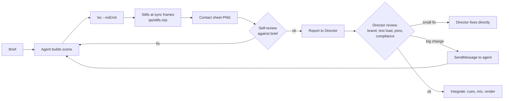

# 02 · The crew and how it was orchestrated

The client asked for "a team of creative crew (leading agent with subagents) led by an experienced Director". We ran it as one **lead agent (Director)** that owns the vision, the timeline and every final decision, plus **subagents** for bounded, parallelisable work.

## 1. Roles

| Role | Who | Responsibilities | Inputs | Outputs | Tools |
|---|---|---|---|---|---|
| **Director** (lead) | main session | Concept, treatment, colour law, timeline, core components, 7 of 13 scenes, frame-by-frame QA, mix, render, delivery, all client comms | Everything | Treatment, system, scenes, mix, final MP4 | All |
| **Brand & Docs Researcher** | subagent | Pull product docs faithfully, find logos/fonts/colours, compliance language | Doc URLs, website | `docs/00-product-and-brand.md`, `assets/brand/`, `assets/fonts/` | WebFetch, curl |
| **Quant Analyst** | subagent | Measure current regime (vol, liquidations, positioning), write the volatility narrative, chart-ready JSON | Hyblock MCP, Hyperliquid API | `docs/03-quant-brief.md`, `data/market.json` | Hyblock MCP, Python |
| **Script Writer** | Director (merged) | Lines, on-screen words, claim map, read direction | Quant brief, research | `docs/04-script.md` | — |
| **SFX / Audio Designer** | subagent (then Director) | Palette of generated + synthesised SFX, tuned, analysed | Music key/tempo, visual vocabulary | `audio/src/sfx/**`, `tools/sfx_synth.py` | ElevenLabs MCP, numpy/scipy |
| **Motion Designer B** | subagent | S06–S08 ("how it works" loop steps 01–04) | Motion brief, theme, components, data | 3 scenes + contact sheets | Remotion, Node QA tools |
| **Motion Designer C** | subagent | S10–S12 (risk, proof, where it runs) | Same | 3 scenes + contact sheets | Same |

```mermaid
flowchart TB
    D((Director<br/>lead agent))
    D --> R[Brand & Docs<br/>Researcher]
    D --> Q[Quant Analyst]
    D --> S[SFX Designer]
    D --> MB[Motion Designer B<br/>S06–S08]
    D --> MC[Motion Designer C<br/>S10–S12]
    R -. docs/00 .-> D
    Q -. docs/03 + market.json .-> D
    S -. sfx palette .-> D
    MB -. scenes + sheets .-> D
    MC -. scenes + sheets .-> D
    D -->|owns| SYS[theme · timeline · components<br/>S01–S05, S09, S13 · mix · render]
```

## 2. What the Director kept, and why

| Kept by the Director | Reason |
|---|---|
| Treatment, colour law, typography | One taste. Split ownership produces a collage. |
| `timeline.ts`, `theme.ts`, `anim.ts`, `components/ui.tsx`, `Star.tsx` | Shared contracts. Subagents may *use* them but not edit them, which avoids merge conflicts and style drift. |
| Hardest/hero scenes (S01–S05, S09, S13) | They carry the concept: the whipsaw, the freeze, the reveal, NO TRADE, the logo. |
| The mix | Needs the whole film's context (ducking, levels, spotting). |
| Final QA and every client-facing message | Accountability. |

## 3. Anatomy of a good subagent brief

Every brief we sent (verbatim copies in [11-prompt-library.md](11-prompt-library.md)) had the same skeleton:

| Section | What it says | Why it matters |
|---|---|---|
| Role + mission | "You are the QUANT ANALYST on a creative crew making …" | Sets expertise and stakes |
| Context the agent can't infer | Product facts, backtest numbers, dates, today's date | Agents start with zero context |
| What to read first | Exact file paths (motion brief, colour system, script, theme, components) | Consistency with the system |
| Exact deliverables | File paths, JSON shape, sections of the memo | Makes hand-back mechanical |
| Timing contract | Scene film window, local frames, VO words to sync (`wordF('L11','hours',1)`) | Frame-accurate sync without back-and-forth |
| Design per scene | What the viewer should see, which elements, one turquoise element, ground colour | Removes ambiguity |
| Rules | "Don't touch other files", "don't commit", "use theme tokens not the skill's palette", "never draw a logo yourself" | Prevents collisions and brand errors |
| QA loop | How to render stills and contact sheets, what to check | Agents self-verify before handing back |
| Report format | "Reply with a concise summary: files, issues, requests" | Director can review fast |

**Tips that paid off**

- Give **frame numbers**, not "around the middle". Every VO word the scene syncs to came with its local frame.
- Name the **single turquoise element** per scene. It forces a focal point and keeps the accent at ≤10 %.
- Put reusable rules in one shared doc (`docs/05-motion-brief.md`) and point every agent at it, instead of repeating rules in every brief.
- Ask for **contact sheets**, 18–20 frames at key sync points. The Director can then review a 480-frame scene in one image.
- Tell agents which files they **own** (`scenes/S06–S08.tsx`, `components/S06_*.tsx`), and that everything else is read-only.

## 4. Hand-back and review loop



The Director made small fixes directly instead of re-briefing an agent. Examples: S08's invented percentage labels were removed, and the `StepHeader` exit bug the agent reported was fixed in the shared component.

## 5. Mid-flight directives

The client changed direction several times during production. Each directive was applied everywhere at once:

| Client directive | How it propagated |
|---|---|
| "Peak detailed attention to SFX, relatable to the motion, crisp and pleasant" | Added a **`CUES` export contract** to every scene, so the mix is generated from the animation itself. Built a tuned synth bank and a harshness analyser. |
| "Motion animation… go ALL in, 2D + 3D" | Real-time 3D (R3F) for the canyon, the liquidation butterfly, the star core, the dot field and the logo extrusion |
| "Only one or two hero plates; accurate token logos; use an icon library" | Cut from a planned 4+ plates to 2. Tokens come only from `cryptocurrency-icons` / `@web3icons/core`. |
| Official colour system supplied | Rewrote `theme.ts` and `docs/02-color-system.md`; regraded plates; all scenes re-checked |
| "Too much text on screen" | SendMessage to both Motion Designers. Director trimmed S01/S02/S03/S09/S13. Rule became: labels ≤ 3 words, numbers are the text. |
| "Remove USDC in / USDC out" | Cut the scene section, the VO line and one bar of music. Re-exported cues, remixed, re-rendered. |

## 6. Orchestration lessons

| Lesson | Detail |
|---|---|
| Parallelise the *scenes*, not the *system* | Two Motion Designers worked in parallel on scenes in separate files, because the Director had already built and frozen the shared system |
| A cancelled subagent may not be relaunchable | A user interrupt cancelled the Quant and SFX subagents. The harness forbade relaunching without an explicit user ask, so the Director finished their work. Keep briefs in files so anyone can pick them up. |
| Agents need today's date and "honesty" instructions | The Quant counted 91 direction changes including the still-open candle. The honest count, with closed candles only, was 89. The VO was re-recorded. Tell data agents: *closed candles only, state the method*. |
| Ask agents to report issues with shared files | Motion Designer B found the `StepHeader` exit bug and Designer C found the hard-coded `MonoHead` turquoise dot. The Director fixed or triaged them centrally. |
| Keep the client in the loop with visuals | Contact sheets and a half-size draft of the first 65 s got a fast "looks good" before the 40-minute full render |
