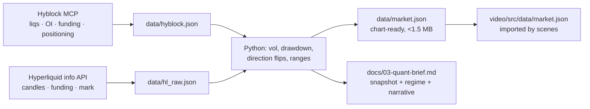

# 03 · Research and market data

A product launch film for a trading agent lives or dies on **credibility**. Every number on screen had to be real, dated and sourced. Every product claim had to be quotable from the docs, and every performance figure had to be labelled *simulated*.

## 1. Product and brand research

**Inputs**
- https://docs.deploy.finance/products/agents/superstar/overview
- https://docs.deploy.finance/products/agents/superstar/how-it-works
- Related pages: risks, who-is-it-for, execution, dynamic-builder-fees, how-to-choose, FAQ
- The website (`deploy.finance`, `/superstar` landing page, blog)

**Method**
1. Fetch each page (WebFetch, or `curl` through the HTTPS proxy with `--cacert /root/.ccr/ca-bundle.crt`).
2. Capture claims **verbatim**, with the URL for each.
3. Pull brand assets from the site's HTML and Webflow CSS: logo SVGs, favicon, `@font-face` URLs (Geist Mono, Season Sans/Serif), colours, taglines, hero copy.
4. Write everything into `docs/00-product-and-brand.md`, with sections for product facts, risks and compliance language, and brand (files saved, fonts, colours, tone).

**What we got**

| Category | Captured | Used for |
|---|---|---|
| How it works | 4-step loop every 4 h: read the last 4 h → build a picture from 18 inputs → argue bull and bear with invalidation levels → choose long / short / no trade | Act II structure (S05–S09) |
| Risk rules | Loss limit before entry, never widened; size follows the limit; stop only moves to protect | S10 |
| Backtest | $100k → $271,465 (+171.46 %), 688 trades, 52.3 % win, 13.6 % max DD, 1,350 of 2,298 reviews no-trade, shorts +$130,427 / longs +$41,038, BTC ~$104k → $124k → $63k | S09, S11 |
| Venue | Hyperliquid spot, perps, HIP-3; USDC settlement; $10,000 USDC minimum | S12 (USDC part later cut) |
| Compliance | "Simulated backtest, not live customer trading … Not investment advice" | S11 label, S13 line |
| Brand | Logo SVGs (indigo mark #474DEF), Geist Mono, Season Sans/Serif (commercial), landing lines "Nothing is a valid move." and "Risk first. Then the trade." | Look + copy |

> **Font licensing:** Season Sans/Serif are commercial (Displaay). They were used locally for rendering but are **gitignored** (`assets/fonts/.gitignore`, `video/public/fonts/.gitignore`: `Season*.woff2`). Never commit licensed font files.

The client later supplied the **official logo SVGs** (white-text and black-text lockups) and the **official colour system**. Both override anything scraped from the site.

## 2. Market data: sources

| Source | Access | What we pulled | Notes |
|---|---|---|---|
| **Hyblock Capital MCP** | `mcp__Hyblock__*` tools (load via ToolSearch) | Daily liquidations (long/short) for 50 days, open interest, funding, true-retail and whale positioning, last-4h readings | Timestamps are **unix seconds** (ms is rejected). `limit` must be one of 5/10/20/50/100/500/1000. Call `hyblock_catalog` first for coin/exchange ids. |
| **Hyperliquid public info API** | `POST https://api.hyperliquid.xyz/info` (`tools/pull_market.py`) | Candles 1d (420 d), 4h (90 d), 1h (10 d); hourly funding (30 d); live mark price (`metaAndAssetCtxs`) | No key needed. It's the venue Superstar trades on, so it's on-brand. |
| Binance API | ✗ | — | Geo-blocked (HTTP 451) from the container. Hyperliquid replaced it and Hyblock cross-checked it. |

Useful Hyblock calls (the ones that mattered):

| Tool | Params that worked | Gives |
|---|---|---|
| `hyblock_catalog` | — | coin + exchange ids |
| `hyblock_klines` | `{coin:"btc", exchange:"binance_perp_stable", timeframe:"1d", limit:50, sort:"desc"}` | cross-check prices |
| `hyblock_liquidation` | daily, 50 rows | `[t, long, short]` per day |
| `hyblock_open_interest` | aggregate | OI level and changes |
| `hyblock_funding_rate` | daily | sign and share of positive funding |
| `hyblock_true_retail_long_short`, `hyblock_whale_retail_delta` | 1h | positioning readings for S06 |

## 3. The quant computations

All of this is in `data/market.json` and documented in `docs/03-quant-brief.md`.

| Metric | Method | Value (2026-09-25) |
|---|---|---|
| Mark price | Hyperliquid ctx | $83,780 |
| ATH / drawdown | max of 1d closes / (price − ATH) ÷ ATH | $126,297 (2025-10-06) / −33.7 % |
| Low since ATH / bounce | min after ATH / (price − low) ÷ low | $57,768 / +45 % |
| Realised vol | stdev of daily log returns × √365 | 7d 49.0 %, 30d 42.5 %, 90d 38.9 % (vol expanding) |
| 30-day range | min/max of daily lows/highs | $74,903 – $87,471 (16.8 %) |
| **Direction changes** | Last **180 closed** 4h candles (30 d). Sign of close-to-close change; **skip flat candles**; count sign flips. | **89** |
| Liquidations 30 d | Sum of Hyblock daily longs/shorts, Binance BTC perps, Aug 26 → Sep 24 | Longs $541.6M, shorts $615.7M |

> **Honesty catch:** the first count said **91**, because it included the still-open 20:00 UTC candle and counted flats inconsistently. The Director recomputed with closed candles only and flats ignored, got **89**, and re-recorded the narration line (a 4-take pickup). Define the counting rule in writing *before* the number goes into the script.

## 4. Turning data into story

The regime, in one sentence: **a violent two-way range after a deep drawdown, where leverage gets flushed from both ends.**

| Regime fact | Superstar feature it sets up | Scene |
|---|---|---|
| 89 direction changes in 30 days | Direction is a coin flip, so you need both sides | S01 |
| $542M longs + $616M shorts liquidated | Picking one side gets punished | S02, S03 |
| Chop | Sits out: 1,350 / 2,298 reviews no-trade | S09 |
| Fast reversals, squeezes | Loss limit before entry, stops only protect | S10 |
| Deep drawdown then bounce | Backtest spanned that shape and stayed positive | S11 |

The quant brief also offered **opening hooks**. We chose C, "This market doesn't trend. It whipsaws. 89 direction changes in a month.", because it's visual: a price line with a tick on every flip.

## 5. Claims discipline

- Every VO line and on-screen number is listed in the **claim map** in `docs/04-script.md`, with its source.
- Venue labels go on screen when a number is single-venue (`binance btc perps · aug 26 – sep 24 · hyblock`).
- Performance numbers always sit under a visible **"simulated backtest"** label, and nothing is shown after that label leaves the screen.
- No promised returns, no "guaranteed", no "safe". The agent is described as autonomous, not market-neutral.
- Illustrative exhibits (S03 positions, S08 review) are labelled `illustrative`.
- **Don't invent numbers to fill a design.** S08's tug-of-war bar originally showed made-up bull/bear percentages. They were removed because a viewer would read them as conviction scores.

## 6. Checklist for the next film

- [ ] List of doc URLs → researcher brief → `00-product-and-brand.md` with verbatim quotes
- [ ] Confirm official logo files and colour system **from the client** (don't rely on scraping)
- [ ] Check font licences; gitignore commercial fonts
- [ ] Pull data from the product's own venue first, then cross-check with a second source
- [ ] Write counting rules (closed candles, window, venue) next to every number
- [ ] Put `asOf` timestamps in the JSON and the brief
- [ ] Build the claim map before recording VO
