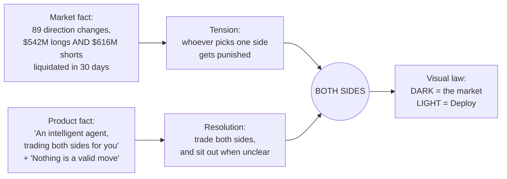
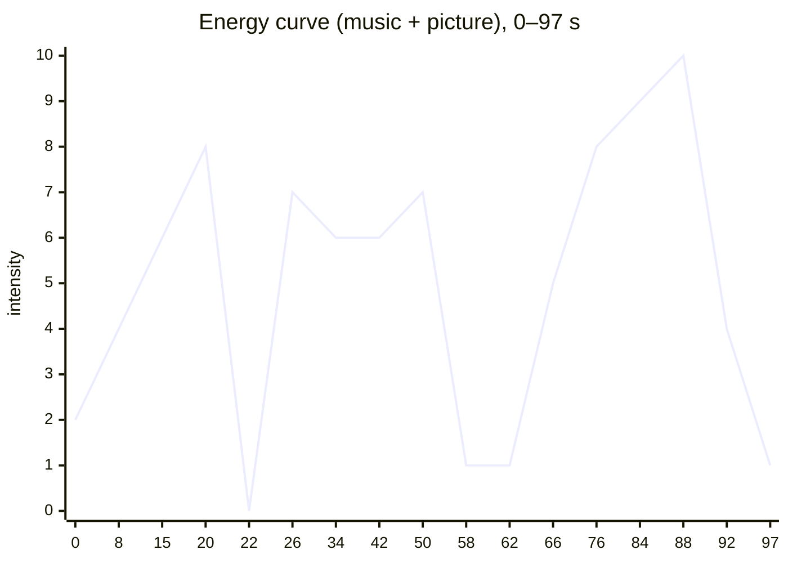

# 04 · Creative direction

## 1. From brief to one idea

The brief asked for an award-level launch film that positions Superstar as "the best bet for the current volatile market". The research gave us the market's defining property. The idea came from joining the two.

**The concept, "Both sides":** the market doesn't trend, it whipsaws, and it punishes anyone committed to one direction. Superstar trades long *and* short, and knows when to do nothing.

**The visual law:** Act I lives in a Soft Black void of 3D candles and liquidations. On the score's impact we iris into Deploy's own product world (Gray ground, white viewport cards, mono status headers, Blue Glow), and we **never go back to the dark**.

## 2. Three-act structure

| Act | Time | Emotional job | Music | Visual world | Scenes |
|---|---|---|---|---|---|
| I · The market | 0–22 s | Unease, then pain | Tense, sparse → urgent → **full stop** | Soft Black, 3D candles, particles, frosted glass | S01 whipsaw · S02 liquidations · S03 pick a side → freeze → collapse to a point |
| II · The agent | 22–65.5 s | Relief, clarity, how it works | **Impact** → confident groove → **drop-out** | Gray + white cards + Blue Glow; the 3D star core | S04 reveal · S05 every 4 h · S06–S08 steps 01–04 · S09 NO TRADE |
| III · Proof + close | 65.5–97 s | Trust, then desire | Rebuild → peak → **final hit** → ring-out | Charts, numbers, brand lockup | S10 risk · S11 backtest · S12 venue · S13 logo |

Two deliberate silences carry the story:
1. **20.2–22.0 s:** the freeze. The music tape-stops, the chart drains to gray and collapses into one breathing point. There's a heartbeat, then silence, then the reveal hits.
2. **58–62 s:** the drop-out. The music falls away right as NO TRADE locks in turquoise. "Or nothing at all" is heard in near-silence. It's the product's signature idea, so it gets the film's quietest moment.

## 3. Scene-by-scene design intent

| Scene | Must communicate | Hero device | 2D / 3D | Single turquoise element |
|---|---|---|---|---|
| S01 | This market doesn't trend | Canyon plate tilts up into a 30-day price line; a tick per direction flip; counter grows into a hero **89** | Plate + 2D | live dot |
| S02 | Both sides get liquidated | 3D "butterfly": candle row with liquidation bars above (shorts) and below (longs); auto-framed orbit; frosted-glass counters | 3D | — (dark act) |
| S03 | Picking a side costs you | 48 h tape; 4 biggest swings: LONG at highs flushed, SHORT at lows squeezed (✕ + sparks); **freeze**, drain to gray, collapse to a seed | 2D | — |
| S04 | Meet Superstar | Iris from the seed; Kling plate assembles the star; handoff to the matching real-time 3D star | Plate → 3D | — |
| S05 | Every 4 h, one decision | Blue Glow floods out of the star; 24 h clock ring, 6 review nodes light as a sweep passes | 2D + 3D star | — |
| S06 | 01 Read the last 4 h | Four hourly columns with real candles; scan bar; OI line and liquidation twin bars | 2D | `now` dot |
| S07 | 02 Build a picture (18 signals) | 18 chips in 5 lenses; lanes bundle into a ribbon; pulses flow into the 3D core; lenses light on their words | 2D + 3D | quadrant `now` point |
| S08 | 03 Argue both sides → 04 Choose | Bull vs Bear cards with invalidation prices that lock on "exact level"; dashed lines snap onto the chart; fold into LONG / SHORT / NO TRADE | 2D | card head dot |
| S09 | Nothing is a valid move | Match cut onto Blue Glow; SHORT → **NO TRADE locks turquoise**; 3D field of 2,298 dots, 1,350 go quiet in a wave | 2D + 3D | NO TRADE |
| S10 | Risk first | Rule rows 01/02/03; loss limit locks before entry, snaps back when dragged; LIMIT ÷ STOP = SIZE; stepped trailing stop ratchets up | 2D | latest stop step |
| S11 | Proof (simulated) | BTC path (gray) vs equity (Blue Glow) drawing month by month; $271,465 count-up; stat tiles; both halves ✓ | 2D | +171.46 % chip |
| S12 | Where it runs | "Spot. Perps. HIP-3." on rails converging into the Hyperliquid mark | 2D | — |
| S13 | Superstar, now live | Official mark extruded in 3D flies in, lands on the beat, docks into the lockup; wordmark glyphs rise; "Superstar" + spinning star; NOW LIVE | 3D → 2D | NOW LIVE pill |

## 4. Design system (held strictly)

The official colour system is documented in `superstar/docs/02-color-system.md`, and `video/src/theme.ts` mirrors it 1:1.

| Rule | Implementation |
|---|---|
| 60-30-10 | ~60 % Soft Black/White/Gray surfaces, **~30 % Blue Glow** (panels, numerals, the core, active states, the equity area), ≤10 % turquoise |
| Exactly one turquoise element per scene | Named in every brief |
| Ramps only, no opacity tints | `mixHex(a, b, t)` animates between two ramp steps. The only static opacity is `C.frost = rgba(255,255,255,0.1)` (frosted glass on dark). |
| Approved pairings | White on Blue Glow / Soft Black; #131313 on White/Gray; black on turquoise |
| Forbidden | Turquoise text on blue, blue text on turquoise, white on turquoise, Soft Black body text on Blue Glow |
| No green/red for long/short | Active = Blue Glow, inactive = Gray ramp, plus the label |
| No gradients or glows | The only chart gradient allowed is the equity area fading into the ground (S11) |
| Token logos | Only from `cryptocurrency-icons` (CC0) and `@web3icons/core` (MIT), via `<Token id=… />`. Their own brand colours are the one sanctioned exception. |
| Generated plates | Graded by a luminance/chroma map onto ramp steps so every pixel lands on the palette |

**Typography**

| Face | Use | Sizes at 1080 px width |
|---|---|---|
| Season Sans 500 | Headlines, body | 64–176 px headlines, ≥36 px body, tracking −0.02em |
| Season Serif | Statement numerals (89, $271,465), accent words in Blue Glow ("both sides for you.", "first.") | up to 220 px |
| Geist Mono | Lowercase status headers (`superstar · signal bus`), uppercase micro-labels (.14–.18em tracking), data | ≥22 px |

**Surfaces:** Gray `#F6F6FF` ground; white viewport cards (2 px Gray-600 border, 44 px radius, soft neutral shadow `0 60px 140px -90px rgba(19,19,19,.35)`); mono status header with a live dot.

**Safe area for 9:16 social:** text within x 72–1008, y 250–1600. Platform UI covers the top and bottom.

## 5. Motion laws

| Law | Value |
|---|---|
| House easing | `cubic-bezier(.3,.7,.2,1)` (`EASE.sys`); expo-out for arrivals, ease-in for exits |
| Springs | `settle(f, start, dur, overshoot)`: one overshoot, no wobble |
| Draw-ons | 1.2–1.6 s |
| Count-ups | easeOutCubic, with a tick train that follows the same easing |
| Type | Masked word rises (`Reveal`), stagger 3–6 frames |
| Never frozen | Continuous camera drift (scale 1.00→1.03, or a 10–20 px translate) per scene |
| Entrances / exits | In within ~20 frames, out in the last ~16, unless it's a match cut |
| Cuts | On bar lines of the 120 BPM score (every 2 s) |
| Determinism | Only `useCurrentFrame()`. No CSS animation, no `Math.random` (seeded `rng()` instead). |

## 6. Less text, more motion (client feedback, applied everywhere)

After seeing the S13 contact sheet, the client said: *"too much text … it should be a highly visual motion animation video."* The rules that followed:

| Before | After |
|---|---|
| Sentences on cards, legal paragraph, URL on end card | One mono compliance line; the rest is the lockup |
| Reading tables (S06) | Candles + one line + twin bars; 3 big numbers in a band |
| Footers under every scene | Removed |
| Explanatory captions | The narrator explains; the screen shows *things*. Labels ≤ 3 words. |
| Numbers inside sentences | Numbers **are** the text: huge serif numerals |

Rule of thumb: if a line on screen repeats what the narrator says, cut it or turn it into an object (a chip, a bar, a number, a lock).
