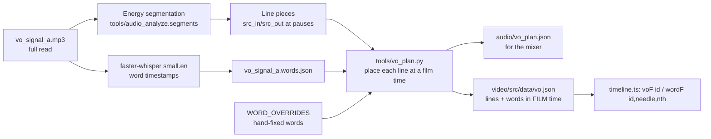

# 05 · Script and voiceover

## 1. Writing the script

**Voice brief:** calm, exact, disciplined. It should sound like a systematic trading desk explaining its rules, not a hype read. About 170 words over 97 s, which leaves room for the score's two breaths: the freeze at 20–22 s and the breakdown at 58–65 s.

**Method**
1. Start from the quant brief's "film-ready facts" and the product's own lines ("trading both sides for you", "Nothing is a valid move", "Risk first").
2. One line per scene beat. Each line is either a **fact with a number** or a **product rule**. No adjectives that can't be proven.
3. Write the **on-screen words** column next to the VO. They should be the key noun or number only, never the sentence.
4. Build the **claim map**: every line → a source (quant brief row, docs URL, landing page).
5. Read it aloud against the music structure. Lines must end *before* the big hits (22.0, 58.0, 88.0 s) so the hits land in air.

**Final script** (film times after placement):

| # | Film s | VO | On screen |
|---|---|---|---|
| L01 | 1.00 | This market doesn't trend. | price line + `btc-perp · 4h · hyperliquid · 30d` |
| L02 | 3.00 | It whipsaws. | *It whipsaws.* |
| L03 | 4.60 | Eighty-nine direction changes in a month. | **89** direction changes |
| L04 | 8.30 | Five hundred and forty-two million dollars of longs, liquidated. | **$542M** longs liquidated |
| L05 | 12.20 | Six hundred and sixteen million of shorts. | **$616M** shorts liquidated |
| L06 | 15.80 | Pick one side, and this market makes you pay. | LONG ✕ · SHORT ✕ |
| L07 | 18.80 | Unless you can trade both. | "both" → freeze |
| L08 | 22.35 | Meet Superstar. | **Superstar** |
| L09 | 23.55 | An intelligent agent, trading both sides for you. | *both sides for you.* |
| L10 | 27.00 | Every four hours, it takes a fresh read of the market, and makes one decision. | Every four hours. / One decision. |
| L11 | 34.40 | It reads the last four hours, hour by hour. | 01 Read the last four hours |
| L12 | 42.20 | Weighs eighteen market signals: leverage, liquidations, order flow, whales against retail. | 02 · 18 |
| L13 | 50.20 | Argues the bull case, and the bear case, each with the exact level that proves it wrong. | 03 · Bull / Bear · $82,835 / $85,277 |
| L14 | 55.40 | Then it chooses. Long. Short. Or nothing at all. | 04 · LONG · SHORT · NO TRADE |
| L15 | 60.20 | In the backtest, it sat out 1,350 of 2,298 reviews. | **1,350 / 2,298** · Nothing is a valid move. |
| L16 | 67.20 | Risk comes first. The loss limit is set before entry, and never widened. | Risk *first.* · 01 Loss limit first |
| L17 | 72.60 | Size follows the limit. The stop only moves to protect. | 02 · 03 |
| L18 | 76.80 | Backtested as Bitcoin rose to one hundred and twenty-four thousand, and fell to sixty-three, | $104k · $124k · $63k |
| L19 | 81.60 | it finished positive through both halves. | **$271,465** · +171.46 % |
| L20 | 84.20 | Spot, perps, and HIP-3, on Hyperliquid. | Spot. Perps. HIP-3. |
| ~~L21~~ | ~~88.00~~ | ~~USDC in. USDC out.~~ | *cut in client review* |
| L22 | 89.00 | Superstar. Now live on Deploy. | lockup · NOW LIVE |

**Writing tips that worked**
- Use **ellipses (…)** in the TTS prompt to get breaths between sentences (`This market doesn't trend… It whipsaws…`).
- Spell numbers out the way you want them said ("one thousand, three hundred and fifty"). Whisper then returns digits, which is fine for timing.
- Put the product's own phrasings in the narrator's mouth. They're pre-approved claims.
- **Avoid lines that need context to make sense.** "USDC in. USDC out." was accurate (the docs say it), but viewers without crypto context couldn't parse it, so the client cut it. Test every line with "would a smart outsider get this?"

## 2. Casting the voice

| Step | Detail |
|---|---|
| Search | `creative_list_voices` with `languages:["en"]`, `use_cases:["advertisement"]`, `descriptives:["confident"]`, and a search for "cinematic calm deep narrator" |
| Shortlist | 3 voices: `e70vjI59gG5dZUD6cZTQ` ("charliee"), `oHB9Xhox1bqMl1Tvkmel` ("jerry"), `dDFwUy1jwGLD1X8PGYKg` (**"Signal – Deep Contemplative Narrator"**) |
| Generate | The whole script in one call per voice (`eleven_multilingual_v2`, `generations_count: 2`), so 6 takes. A single read keeps the performance continuous across lines. |
| Choose | **Signal, take A.** Calm authority, no hype, lands numbers cleanly. |
| Pickup | When 91 became 89, we generated 4 takes of **only the first three lines**, same voice, read in context. We chose take 2 and level-matched it +2.5 dB. |

## 3. Word-level timing

The scenes sync to *words* ("Long." lands the highlight), so every word needs a film time.

| Problem | Fix |
|---|---|
| Whisper word stamps run up to ~0.6 s early | Snap each piece's first word to the piece's measured **energy onset**, then shift the rest by the same amount |
| Some short words misaligned ("Long." "Short." "Or") | `WORD_OVERRIDES` distributes listed words sequentially inside a piece with hand-set durations |
| Whisper spells words oddly ("wails" for whales, "hip3") | Scenes search with the spelling Whisper produced (`wordF('L12','wails')`, `wordF('L20','hip3')`) |
| Lines need to land on beats, not where the read put them | `LINES` gives each line a **film start**. Internal pauses are kept, or tightened with a fixed `gap`. |

`timeline.ts` exposes:
- `voF(id)`: film frame where line `id` starts
- `wordF(id, needle, nth=0)`: film frame of the nth occurrence of a word in that line
- `local(sceneId, filmFrame)`: converts to the scene's local frame

A scene then writes `superstar: local('S04', wordF('L08','superstar'))`. If the VO moves, the animation moves with it.

## 4. Placement rules we used

| Rule | Example |
|---|---|
| Leave the big hits clear | L07 ends at 20.2, then freeze, silence, impact at 22.0, and L08 starts at 22.35 |
| Put key words in the silence | "Short." at 58.18 falls just after the music drop at 58.0. "Or nothing at all." at 59.07 plays in near-silence. |
| Hero words land on beats | "Superstar" (L22) at 89.0 s, the same frame the 3D logo lands |
| One line per scene where possible | Scene windows were set around the lines, not the other way round |

## 5. Processing in the mix

Each line is loudness-matched to −17 LUFS (plus a per-line trim), with a 180 Hz −1.5 dB dip, a 6.8 kHz −2 dB de-ess, and 6 ms / 30 ms fades. See [09-sound-design-and-mix.md](09-sound-design-and-mix.md).

## 6. Changing a line later

1. Edit `LINES` in `tools/vo_plan.py` (remove, retime, or point to a pickup file in `LINE_SRC`).
2. `python3 tools/vo_plan.py` regenerates `audio/vo_plan.json` and `video/src/data/vo.json`.
3. Fix any scene that referenced the removed line (`wordF('L21', …)` will throw).
4. `cd video && npm run cues`, then `python3 tools/mix_audio.py`, then re-render.
