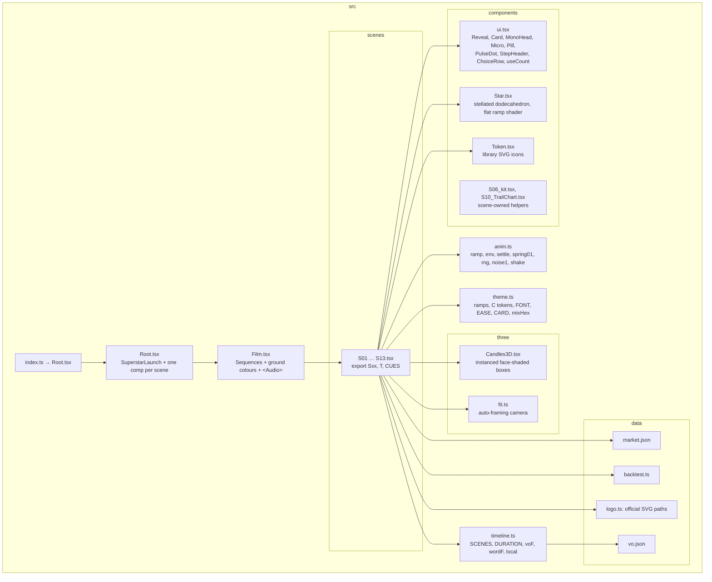
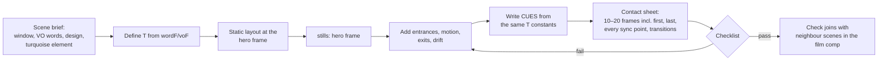

# 07 · Motion design in Remotion (2D + 3D)

About 95 % of the picture is **code**: React components rendered frame by frame by Remotion, with real-time 3D from React Three Fiber (three.js). Code-driven motion is exact, since data comes straight from JSON. It's on-brand, since colours come from tokens. It's frame-synced to VO and music, and it's editable in minutes.

## 1. Stack

| Piece | Version | Role |
|---|---|---|
| Remotion (`remotion`, `@remotion/cli`, `@remotion/renderer`, `@remotion/bundler`) | 4.0.529 | Compositions, Sequences, frame clock, rendering |
| `@remotion/three` + `@react-three/fiber` 9.3 + `three` 0.180 | — | `<ThreeCanvas>` 3D inside a frame |
| `@remotion/fonts` | — | Deterministic font loading (`fonts.ts`) |
| `cryptocurrency-icons` (CC0), `@web3icons/core` (MIT) | — | Accurate token logos (BTC, ETH, SOL, USDC, Hyperliquid) |
| React 19, TypeScript 5.9 | — | — |
| Headless Chromium `/opt/pw-browsers/.../headless_shell` + `gl: 'swangle'` | — | CPU WebGL rendering in a container (no GPU) |

`remotion.config.ts`:

```ts
Config.setBrowserExecutable('/opt/pw-browsers/chromium_headless_shell-1194/chrome-linux/headless_shell');
Config.setChromiumOpenGlRenderer('swangle'); // CPU WebGL (SwiftShader via ANGLE) for three.js
Config.setVideoImageFormat('png');
Config.setConcurrency(4);
Config.setCodec('h264');
Config.setCrf(14);
Config.setPixelFormat('yuv420p');
```

`tsconfig.json` needs `resolveJsonModule: true` (to import data) and `noUnusedLocals: false` while iterating.

## 2. Project architecture



**Conventions every scene follows**

```tsx
export const T = {                      // LOCAL frames, derived from VO words where possible
  every: local('S05', voF('L10')),
  one:   local('S05', wordF('L10', 'one')),
  sweep0: 96, sweep1: 396, exit: 452,
} as const;

export const S05: React.FC = () => {
  const f = useCurrentFrame();          // the only clock
  const flood = ramp(f, T.flood, 30, EASE.out);
  ...
};

export const CUES = [                   // sound contract (see 09)
  {at: 0, kind: 'whoosh', note: 'Blue Glow floods out of the star'},
  {at: T.sweep0, kind: 'clock_sweep', note: `dur=${T.sweep1 - T.sweep0} sweep hand`},
  ...
];
```

- `Root.tsx` registers `SuperstarLaunch` (the film) and **one composition per scene** (`S01`…`S13`), so any scene can be rendered on its own.
- `Film.tsx` places each scene in a `<Sequence from={SCENES[id].from}>` on its ground colour and plays `public/audio/mix.wav`.
- Scene windows live in one place (`timeline.ts`). Changing a scene's length means editing one line; everything downstream (cues, mix) follows.

## 3. Core helpers

| Helper | Signature | Use |
|---|---|---|
| `ramp` | `(f, start, dur, ease=EASE.out) → 0..1` | Every tween |
| `env` | in → hold → out envelope | Elements that appear then leave |
| `settle` | `(f, start, dur, overshoot=0.12)` | Spring with one overshoot (pills, cards, counters) |
| `rng(seed)` | mulberry32 | Deterministic randomness (never `Math.random`) |
| `noise1(x, seed)` | smooth 1D value noise | Drift, jitter, particle wander |
| `shake(f, at, amp)` | decaying camera shake | Impacts |
| `mixHex(a, b, t)` | colour between two ramp steps | Colour animation without opacity tints |
| `useCount` | count-up hook | Numbers |
| `Reveal` | masked word rise with stagger | All headline type |
| `StepHeader` | serif numeral + title with masked in/out | "01 Read…", "02 Build…" |
| `ChoiceRow` | LONG / SHORT / NO TRADE selector with `active`, `lock` | S08 → S09 match cut |

## 4. 2D techniques (with where they're used)

| Technique | How | Where |
|---|---|---|
| Draw-on lines | SVG path + `strokeDasharray = len · progress` | S01 price line, S05 clock ring, S10 limits |
| Tick per data event | Compute flip indices from data. Invert the draw easing to find the frame the drawing head passes each flip. | S01 (89 ticks) |
| Masked type | `overflow:hidden` wrapper + `translateY(110% → 0)` | All headlines |
| Count-up | `Math.round(value · ease(t))` with `tabular-nums` | 89, $542M, 1,350, $271,465 |
| Iris transition | SVG mask: full rect minus a growing circle, plus a Blue Glow ring stroke | S03 → S04 |
| Panel flood | `clipPath: circle(r at x y)` growing from the star | S05 |
| Card contract + fly | Animate width/height/radius, then translateY | S05 → S06 |
| Match cut | End state of scene N = start state of scene N+1 (same component, same props) | S08 → S09 (`ChoiceRow`), S10 → S11 (chart card) |
| Curtain | Full-bleed panel translates away to reveal the next ground | S09 → S10, S11 → S12 |
| Footage mask | `mask-image: linear-gradient(...)` to feather plates or 3D into the ground | S01 plate, S04 plate floor, S09 dot band |
| Stepped trailing stop | Path with horizontal steps; each step starts on a ratchet cue | S10 |

## 5. 3D techniques

All 3D renders through `<ThreeCanvas width={W} height={H}>` inside an `AbsoluteFill`, with state driven by the frame (set in `useLayoutEffect` each render).

| Technique | Implementation | Where |
|---|---|---|
| **Instanced face-shaded boxes** | `InstancedMesh` of boxes. Colour per face from a palette row `{top, lit, dark}` (flat, no lighting), so every pixel is an exact ramp colour. | S02 candles + liquidation bars |
| **Auto-framing camera** (`three/fit.ts`) | Given world points, azimuth, elevation, fov and a target screen rect, binary-search the camera distance so all points project inside the rect | S02 orbit (az 16→40°, el 2→12°) |
| **Flat ramp shader** | `ShaderMaterial` mapping `dot(normal, light)` onto a continuous ramp of brand colours. Uniforms passed as **raw sRGB `Vector3`** (not `THREE.Color`, which converts to linear and oversaturates). | Star core (`Star.tsx`) |
| Stellated dodecahedron | Custom geometry `starGeometry(r, spike)` + `EdgesGeometry` seams | The Superstar core |
| Ortho pixel camera | Orthographic camera sized to 1080×1920, so 3D objects are positioned in pixels and match 2D layouts exactly | Star3D, S13 logo |
| Dot field | `InstancedMesh` of 2,298 circles; per-instance colour/scale updated each frame; wave ordering precomputed | S09 |
| **SVG → extruded 3D logo** | `SVGLoader().parse(<path d=LOGO.mark>)` → `createShapes` → `ExtrudeGeometry` (depth 16, bevel), then `rotateX(Math.PI)` to go from SVG y-down to three y-up without flipping normals | S13 |
| 3D → 2D handoff | Fade the 3D canvas into the identical 2D SVG at the same px position | S13 mark docks into the lockup |
| Plate → 3D handoff | The 3D star matches the plate star's position, size and shading (`STAR_END`, `STAR_LIFT`) and crossfades over 22 frames | S04 |

**Gotchas**

| Gotcha | Fix |
|---|---|
| Colours come out too saturated | three.js treats `Color` as sRGB → linear. Pass raw sRGB as `Vector3` uniforms and write them directly in the fragment shader. |
| Mirrored geometry shows the back face (navy instead of Blue Glow) | `scale(1,-1,1)` flips winding. Use `rotateX(Math.PI)` instead. |
| Star drawn *under* a tiny flood clip on frame 0 disappeared | Render the object above the clip while the clip is small (`f < 30`), then inside it |
| 3D canvas covered the headline | Explicit layer order: background 3D → masks → type |
| Heavy frames with swangle | Keep instance counts in the low thousands, flat shaders, no shadows or post-processing |

## 6. Accurate token logos

The client asked for exact logos from an icon library, never drawn by hand.

```bash
npm i cryptocurrency-icons @web3icons/core
node tools/extract_icons.mjs   # copies btc/eth/sol/usdc (cryptocurrency-icons) and hyper-evm → hyperliquid (+ mono) into public/tokens/
```

`<Token id="btc" size={48} />` renders `staticFile('tokens/btc.svg')`. Token brand colours are the one allowed exception to the palette.

The Deploy logo comes from the **client-supplied SVGs**, converted to path data in `data/logo.ts` (mark path, and per-glyph paths with x-extents for the letter-by-letter build).

## 7. Scene build workflow



**Scene checklist**

- [ ] Colours only from `theme.ts`; one turquoise element; Blue Glow ≈ 30 %
- [ ] No sentence that duplicates the VO; labels ≤ 3 words
- [ ] Text inside the safe area (x 72–1008, y 250–1600), sizes ≥ minimums
- [ ] Every key animation lands on its VO word (check stills at `wordF` frames)
- [ ] Nothing static for more than ~0.5 s (drift is on)
- [ ] First and last frames join cleanly with neighbouring scenes
- [ ] "Simulated backtest" visible whenever performance numbers are
- [ ] `CUES` cover every visible action and use landing frames
- [ ] `npx tsc --noEmit` passes

## 8. Performance notes

| Render | Time (4 vCPU, swangle) |
|---|---|
| Single still at 0.3–0.5 scale | ~1–3 s after bundling (~15–20 s bundle) |
| 2 s at half scale | ~45 s including bundle |
| First 65.5 s at half scale (JPEG frames) | ~10 min |
| Full 97–99 s at 1080×1920, PNG frames, CRF 14 | ~30 min |
