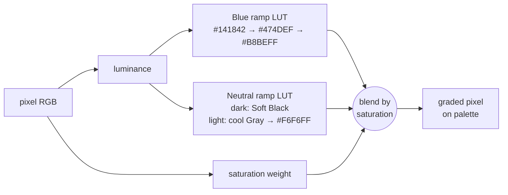

# 08 · Hero plates (generated video)

## 1. Why only two

We first planned four or more generated shots. The client capped it at **"only one or two hero plates. Rest all Remotion or other motion animated tools."** That turned out to be the right call:

| Generated plates | Code-driven motion |
|---|---|
| Photoreal texture, depth, "wow" | Exact data, exact brand colours, exact timing |
| Colours drift off-palette, need grading | On palette by construction |
| Can't sync to words or show real numbers | Frame-accurate sync to VO and data |
| Expensive (~4–5.5k credits per plate at 1080p) | Free to iterate |
| Hard to revise | Revise in minutes |

**Use plates for moments of pure atmosphere or transformation**: the opening world and the reveal. Everything with information is code.

## 2. The plates

| Plate | Scene | Model / settings | Used |
|---|---|---|---|
| **P1 · candle canyon (dark)** | S01 opening | Kling 3 Pro, 9:16, 1080p, 8 s, no audio | ✓ graded dark, 478 frames @ 60 |
| P2 · shattering candle (dark) | (S03 idea) | Kling 3 Pro, 5 s | ✗ not generated (plate budget) |
| **P3 · core assembly (light)** | S04 reveal | Kling 3 Pro, 9:16, 1080p, 6 s | ✓ graded light, 358 frames @ 60 |

Full prompts and negative prompts are in [11-prompt-library.md](11-prompt-library.md#hero-plates). The pattern:

| Prompt part | Example (P3) |
|---|---|
| Medium + surface | "Premium 3D product render on a soft, seamless lavender-white studio background" |
| Subject + action, in order | "Hundreds of small matte indigo-blue ceramic shards … converge … click together into one precise faceted geometric star-shaped polyhedron … locks into shape … then rotates slowly" |
| Camera | "holds centered, then a very slow push-in with shallow depth of field" |
| Light | "Soft diffused studio lighting from above, gentle contact shadows" |
| Style | "Minimal, precise, calm, premium fintech keynote aesthetic, photoreal materials, subtle film grain" |
| Negative prompt | "text, letters, numbers, logos, watermark, neon, rainbow colors, green, red, orange, gold, lens flare, bloom, glow, sparkles, people, hands, dark background, warped geometry, flicker, morphing" |

**Always run `estimate_only: true` first** to see the credit cost before generating.

## 3. Grading plates onto the palette

`tools/grade_plate.py in.mp4 out.mp4 dark|light` uses a **chroma-aware gradient map**:

- Saturated (blue) pixels map along the **Blue Glow ramp**. Neutral pixels map along **Soft Black** (dark plates) or the **cool Gray ramp** (light plates). The two are blended by saturation, so a grey studio floor never turns blue.
- The light map is tuned so the studio background lands **exactly on `#F6F6FF`**, the film's Gray ground. The first grade landed on `#DDDDE7` and showed a visible box. The fix was to move the neutral stops (`(0.585, '#F6F6FF')`).
- Then **retime 24 → 60 fps** with motion-compensated interpolation:
  `minterpolate=fps=60:mi_mode=mci:mc_mode=aobmc:me_mode=bidir:vsbmc=1`

## 4. Integrating a plate in a scene

| Technique | Detail |
|---|---|
| `<OffthreadVideo src={staticFile('plates/p3_core_light.mp4')} startFrom={108} playbackRate={1.25} muted />` | Trim and speed the plate to the music |
| Transform | `translateY(20px) scale(0.9)` around the star centre, to place the star where the 3D star will be |
| Footage mask | `mask-image: linear-gradient(to bottom, black 1290px, transparent 1370px)` removes the plate's floor shadow under the subline |
| Tilt-up reveal (S01) | Plate starts full-frame, then moves up (`plateY` 0 → 740) under a mask, uncovering the chart below |
| **Handoff to real-time 3D** (S04) | Measure the plate star's final centre and size, then position `Star3D` identically (`STAR_END`) with a darker `lift` to match shading, and crossfade over 22 frames. From then on the star is a live object that can move, re-shade and spin through S05 and S07. |

## 5. Costs (ElevenLabs credits, approximate)

| Item | Credits |
|---|---|
| P1 canyon, 8 s 1080p | ~5,429 |
| P3 core, 6 s 1080p | ~4,072 |
| Score, 3 takes | ~3 × 900 |
| Narration, 6 full takes + 4 pickups | ~6 × 1,178 + small |
| SFX, ~64 takes | ~2–13 each |
