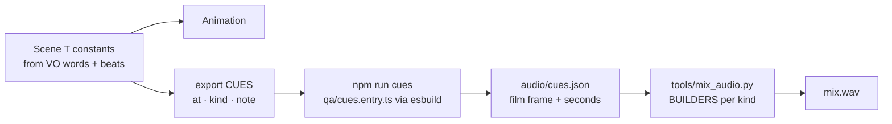
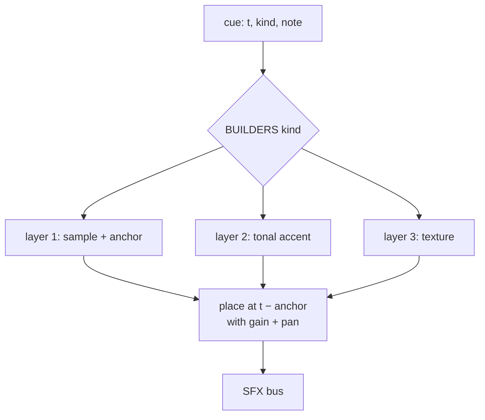
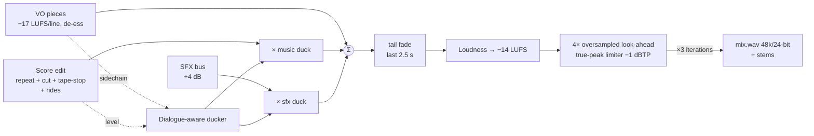

# 09 · Sound design and mix

The client's brief for sound was: *"Peak detailed attention to SFX … relatable with the motions and actions in the frame … crisp and pleasant for the ears, wanting to hear again and again."* This is the most engineered part of the pipeline. The short version is in `superstar/docs/06-sound-design.md`; this file has the full detail.

## 1. The core idea: cues come from the animation code

- Each scene exports `CUES: {at, kind, note}[]` with **local frames at the moment the motion lands** (the transient), computed from the same constants as the animation.
- `npm run cues` bundles `qa/cues.entry.ts` with esbuild, imports every scene module, adds each scene's `SCENES[id].from`, and writes `audio/cues.json` sorted by time (404 → 394 cues).
- Durations go in the note (`dur=146`), so sustained sounds (tick trains, grain cascades, scans) last exactly as long as the motion.
- Data goes in the note too: `flip 12 up`, `long liq day 2 $53M`, `LONG opens`, `review 08:00 lights`. The mixer turns that data into sound.

**Cue kinds used** (with counts in the final film):

| Kind | Count | Meaning |
|---|---|---|
| tick | 112 | Single UI tick; S01's 89 direction flips |
| crackle / crackle_big | 51 / 13 | Liquidation days (small / big) |
| blip | 35 | Data point lights |
| swipe | 33 | Small move, type reveal |
| draw | 21 | Line draw (with dur) |
| pop | 17 | Dot or node appears |
| whoosh | 13 | Big move, card flies |
| lock | 12 | Decision or latch |
| ping | 11 | Pulse arrives at the core |
| type | 10 | Mono text typing (dur) |
| tick_train | 9 | Count-up (dur) |
| card_in / card_out / slide | 9 / 4 / 3 | Card movements |
| impact_soft / impact_big | 8 / 2 | Numbers landing / reveal and logo |
| click | 8 | Position opened, selector |
| shimmer | 7 | Word or state resolves |
| ratchet | 7 | Trailing stop steps up |
| scan | 5 | Scan bar sweep |
| riser, tape_stop, reverse_swell, heartbeat, iris_open, energy_form, star_lock, clock_sweep, cut_hush, grain_in, dotwave, whoosh_reverse, logo_sting | 1 each | Signature moments |

## 2. The palette: two sources

### 2a. Generated (ElevenLabs Sound Effects v2)

Model `eleven_text_to_sound_v2`, one flow for all audio, `generations_count: 2` per sound so there's a choice. The prompts describe the **sound**: material, action, character, "clean, dry, close-mic, no reverb tail". Full list in [11-prompt-library.md](11-prompt-library.md#sound-effects).

| File(s) | Prompt gist | Duration | prompt_influence |
|---|---|---|---|
| whoosh_short_a/b | Fast clean airy whoosh pass-by | 0.8 s | 0.6 |
| whoosh_long_a/b | Smooth deep swoosh, soft low-end body | 1.6 s | 0.6 |
| reverse_swell_a/b | Reverse airy swell into a sudden stop | 1.6 s | 0.6 |
| impact_big_a/b | Deep clean sub impact, tight transient | 2.5 s | 0.7 |
| impact_soft_a/b | Soft muted low thump | 1.0 s | 0.6 |
| iris_open_a/b | Bright airy opening swell, glassy shimmer | 1.6 s | 0.6 |
| energy_form_a/b | Ceramic beads pulled together by a magnet | 2.0 s | 0.5 |
| star_lock_a/b | Crystalline click-lock, short glassy ring | 0.9 s | 0.7 |
| card_slide_a | Soft felt sliding on glass | 0.7 s | 0.6 |
| logo_sting_a/b | Elegant logo sting, deep hit + glassy tonal shimmer in C# | 2.8 s | 0.6 |
| crackle_a | Tiny dry electric spark crackles | 1.0 s | 0.6 |
| riser_a | Low tension riser | 4.0 s | 0.6 |
| ui_click, ui_lock, ui_pop, clock_tick, clock_sweep, freeze_stop, shimmer, heartbeat, number_slam, line_whip | UI and mechanical set (batch 2) | 0.5–2.5 s | — |

### 2b. Synthesised (Python, `tools/sfx_synth.py`)

48 kHz stereo, sample-exact, **tuned to the score's measured key (C#)** using only **C#, G#, D#** (root, fifth, second), so every tonal sound is consonant whatever the harmony does.

| Function | Sound | Design notes |
|---|---|---|
| `blip(note)` | Glassy UI blip | Sine + 2nd/3rd partials, 1.5 ms attack, 70 ms decay, ±0.17 % L/R detune, LP 9 kHz |
| `tick('hi' / 'lo')` | Tiny click | Noise burst + resonant body. **hi** = 4.2–9 kHz glassy, **lo** = 0.9–2 kHz warm. Deliberately avoids 2–5 kHz. |
| `pop(note)` | Rounded pop | Pitch drops 12 % in 20 ms |
| `ping(note)` | Bell-ish arrival | Partials ×1, ×2, ×3.01 with separate decays, 0.7 s |
| `lock_chord()` | **Signature "confirm"** | C#5 · G#5 · C#6 blips 45 ms apart over a soft latch click |
| `ratchet(seed)` | Mechanical click-clack | Two warm band-passed transients 34 ms apart |
| `sub_drop()` | C# sub drop | Pitch falls to half; tanh saturation |
| `heartbeat()` | Lub-dub | Two 58 Hz thumps, LP 400 Hz |
| `tick_train(dur)` | Count-up | Tick spacing follows **easeOutCubic** (like the number), pitch rises 25 %, level falls |
| `grains(dur, density_fn)` | Cascading tuned grains | G#5/C#6/D#6/G#6 micro-tones, random pan, density following the animation's ease |
| `crackle()` | Spark crackle | Tiny noise clicks, HP'd |
| `air(dur)` | Soft swipe | Sweeping band-pass noise, sine envelope |

Built at mix time as well (the mixer imports the module): `spark(size)` (crackle cluster + ember thump scaled by $), `type_train(dur)`, `scribble(dur)` ("pen on glass" draw bed).

## 3. Analyse, then choose

`tools/sfx_analyze.py` measures every take and writes `audio/sfx_analysis.json`:

| Metric | Definition | Used for |
|---|---|---|
| onset | first 5 ms window within 30 dB of peak | Pre-roll, so the transient lands on the frame |
| peak_t | loudest 5 ms window | Anchor for impacts and whooshes |
| tail | time from peak to −40 dB | Overlap planning |
| cent | spectral centroid | Brightness |
| **harsh** | energy share in 2–5 kHz | **Ear fatigue**; lower is kinder |
| sub | energy share below 80 Hz | Rumble control |

Picks based on the numbers:

| Choice | Why |
|---|---|
| `iris_open_a` over `_b` | harsh 0.049 vs **0.581** |
| `reverse_swell_a` over `_b` | harsh 0.186 vs 0.403 |
| `ui_click_a` | centroid 1.4 kHz, harsh 0.011 (clean, soft) |
| `shimmer_b` | harsh 0.006, centroid 8.3 kHz (airy, not piercing) |
| `energy_form_b`, `star_lock_a`, `logo_sting_b`, `impact_big_b`, `number_slam_a` | Clean transients, controlled sub |
| `riser_a` kept, EQ'd hard | Only take; harsh 0.40, so −7 dB at 3.3 kHz and −6 dB shelf above 5 kHz |

Every ElevenLabs take then goes through `tame()`:
- a peaking cut at 3.3 kHz (−1.5 / −3 / −5 dB depending on measured harshness)
- a high shelf at 11 kHz (−1.5 or −3 dB for bright takes)
- a −3 dB dip at 40 Hz for sub-only rumbles
- normalisation to −1 dBFS peak

## 4. Spotting: one builder per kind

In `mix_audio.py`, each kind maps to a builder `B_<kind>(cue, k, ctx)` that returns layers of `(audio, anchor_seconds, gain_db, pan)`. The anchor is the point inside the sample that must land on the cue time.

**Where the sound carries information:**

| Moment | Mapping |
|---|---|
| S01 · 89 direction flips | Turn **down** (a high) → bright tick. Turn **up** (a low) → warm tick. **Pan follows the drawing head** left to right (−0.55 → +0.55). **Pitch climbs** as the counter climbs (+18 %). Level rises 3 dB across the run. |
| S02 · 30 days of liquidations | `spark(size)`: cluster length and count scale with the day's $ (log). Big days add an ember thump + EL crackle + soft impact. |
| LONG vs SHORT | **LONG leans up (C#6), SHORT leans down (G#5)**, layered on the click. Consistent in S03, S08, S09. |
| S05 · six daily reviews | Pings climb **C#5 → D#5 → G#5 → C#6 → D#6 → G#6** toward "One decision". The clock ticks on **every beat** of the score while the hand sweeps. |
| S09 · 1,350 reviews go quiet | Tuned grain cascade whose density follows the counter's cubic ease: dense at first, thinning out |
| S10 · stop ratchets up | Ratchet pitch steps up 3 % per step |
| Count-ups | Tick train with the same easing as the number |

**The sonic signature:** `lock_chord` (C#·G#·C#) plays three times: when the star locks at the reveal (S04), on **NO TRADE** (S09, loudest, in near-silence, plus a UI latch and a shimmer tail), and under the final logo (S13).

**Anti machine-gun rules**
- Round-robin between takes and seeds; small varispeed (±2–3 %), level (±1–3 dB) and pan (±0.15–0.35) variation.
- Same kind within 2 frames merges into one sound. Counted data events (the 89 flips) are exempt.
- Tonal accents are 6–10 dB under their mechanical layer.

**Level targets** (gain in dB applied to −1 dBFS-normalised sounds; final master gain is added later):

| Class | Gain | Examples |
|---|---|---|
| Signature | −5 to −11 | impact_big (−5), logo_sting (−11), NO TRADE chord (−11) |
| Impacts / whooshes | −13 to −16 | impact_soft, whoosh, tape_stop |
| Mechanical UI | −17 to −23 | click, lock, ratchet, pop, swipe, card_in |
| Micro / texture | −24 to −36 | ticks, tick trains, type, shimmer, scan, draw beds |

## 5. The mix

| Stage | Setting |
|---|---|
| Music stem | Normalised to −20 LUFS, then section rides |
| **Dialogue-aware ducking** | In 100 ms windows: music gain = `min(0, VO − 9 dB − music)` while the voice is active (floor −12 dB), plus −3 dB baseline under voice. 40 ms attack, 550 ms release, 100 ms look-ahead, 500 ms hold (rolling max) so it doesn't pump between words. |
| SFX duck | −2 dB under the voice |
| SFX bus | +4 dB overall (after the audibility check) |
| Master | Integrated −14 LUFS (pyloudnorm); 4× oversampled true-peak limiter, 4 ms look-ahead, 80 ms release, ceiling −1 dBTP; 3 iterations |
| Outputs | `audio/mix/superstar_{mix,stem_music,stem_vo,stem_sfx}.wav`, `video/public/audio/mix.wav`, `audio/mix/mix_log.txt` (every placed cue) |

## 6. Mix QA

`tools/mix_report.py [t0 t1]` produces `audio/mix/report_<t0>_<t1>.png` and a text list:

| Panel / list | What to look for |
|---|---|
| Momentary level per stem (400 ms) with cue labels | Music not burying VO; SFX peaks visible at cues; the silences really are silent |
| **VO − music** margin (dB) | ≥ 6 dB whenever the voice talks (target ~9) |
| Spectrogram | No harsh 2–5 kHz band, no hiss beds, clean silences at 20–22 s and 58–62 s |
| **Lowest SFX-over-bed** list | Each cue's SFX peak vs music+VO RMS over the same 150 ms. Median ≈ +3.6 dB. Anything below −10 dB gets raised or re-thought. |

First-pass findings and fixes:

| Finding | Fix |
|---|---|
| Act I music at −47 dB (inaudible) under VO | +9 dB section ride |
| Groove sections only 0–5 dB under VO | Fixed −6 dB duck replaced by the dialogue-aware ducker (VO over music ≥ 9 dB) |
| Swipes, tick trains, cards, shimmers buried (−9 to −15 dB) | +3 dB on those kinds, and the SFX bus +4 dB |

Delivered loudness, measured on the final MP4 with ffmpeg `ebur128`: **I = −14.2 LUFS, LRA 3.1 LU, true peak −0.7 dBFS** (AAC adds about 0.3 dB of overshoot).
