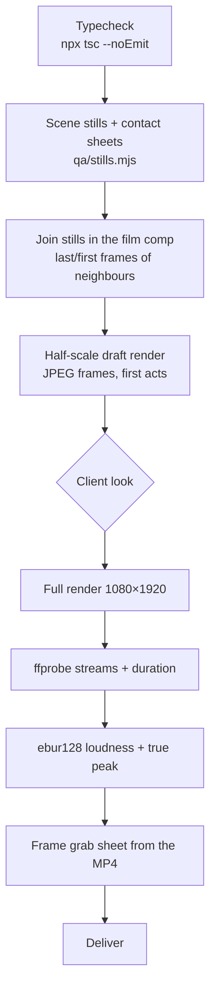

# 10 · QA, render and delivery

## 1. QA layers

| Layer | Tool | Command |
|---|---|---|
| Types | tsc | `cd video && npx tsc --noEmit` |
| Scene stills | `qa/stills.mjs` (bundles once, `renderStill` per frame, PIL sheet via `tools/sheet.py`) | `node qa/stills.mjs S07 /tmp/qa/s07 0,60,144,194,258,322,354,440,479 0.5 6` |
| Film joins | same, on `SuperstarLaunch` | `node qa/stills.mjs SuperstarLaunch /tmp/qa/joins 3925,3935,4555,4565,5035,5045,5279,5280 0.3 8` |
| Cue sheet | esbuild + node | `npm run cues` |
| Mix report | matplotlib | `python3 tools/mix_report.py 0 97` |
| Draft render | Remotion | `npx remotion render src/index.ts SuperstarLaunch out/draft.mp4 --frames=0-3929 --scale=0.5 --image-format=jpeg --jpeg-quality=85` |
| Final render | Remotion | `npx remotion render src/index.ts SuperstarLaunch out/superstar-launch.mp4 --audio-bitrate=320k` |
| Loudness | ffmpeg | `ffmpeg -i out.mp4 -af ebur128=peak=true -f null -` |
| Frame grab | ffmpeg + PIL | `ffmpeg -ss <t> -i out.mp4 -frames:v 1 -vf scale=270:480 f.png` → tile |

## 2. What to look at in contact sheets

| Check | Typical catches in this project |
|---|---|
| Colour law | Plate ground #DDDDE7 vs #F6F6FF; navy logo face (flipped normals); over-saturated star |
| Text load | S13 legal paragraph + URL (cut); S06 readings table (replaced by bars) |
| Overlap / layering | S01 plate bars over the chart (tilt-up + mask); S09 3D field over the headline (mask band + reorder) |
| Framing | S02 camera too far, 3D too small (auto-fit camera + push-in) |
| Sync | Stills exactly at `wordF` frames: is the thing there *on* the word? |
| Transitions | S04 iris too fast (34 f, soft ease); S05 star vanished on frame 0 inside the flood clip |
| Joins | S08 → S09 `ChoiceRow` match; S10 → S11 chart card; S12 clears to plain blue before the S13 cut |
| Honesty | Invented tug-bar percentages in S08 (removed); "live" dot on a simulated backtest (static dot) |

## 3. Render settings

| Setting | Value | Why |
|---|---|---|
| Resolution / fps | 1080×1920 @ 60 | 9:16 social, smooth motion |
| Frame format | PNG (final), JPEG q85 (drafts) | Lossless intermediates for flat colour |
| Codec | H.264, CRF 14, yuv420p | High quality; flat graphics compress well (~2.5 Mbps, ~34 MB for 97 s) |
| Audio | AAC 320 kb/s from the 48 kHz / 24-bit mix | — |
| Concurrency | 4 | Matches 4 vCPU |
| GL | `swangle` (CPU) | No GPU in the container |
| Time | ~30 min for 97 s | — |

> Drafts rendered with JPEG frames come out as `yuvj420p` (full range). Finals use PNG → `yuv420p`, which is what platforms expect.

## 4. Delivery

| Step | Detail |
|---|---|
| Copy | `video/out/superstar-launch.mp4` → `deliverables/superstar-launch-9x16.mp4` |
| Git | Commit the MP4 (under 100 MB is fine on GitHub) and push to the working branch and the session branch |
| Links | Blob URL for viewing: `https://github.com/<owner>/<repo>/blob/<branch>/superstar/deliverables/superstar-launch-9x16.mp4`. Raw URL for download: `…/raw/<branch>/…` |
| Chat preview | The chat upload limit is 30 MiB, and the master was 33.4 MiB. Either send a half-size draft, or re-encode (`libx264 -crf 19 -preset slow -c:a copy`) for chat only. Never replace the master. |
| Never commit | Commercial fonts (`Season*.woff2`), large WAV stems (gitignored), `node_modules`, `out/` |

## 5. Git hygiene used

| Practice | Detail |
|---|---|
| Branches | Work on `deploy-super-star-launch-video`; mirror to the session branch `claude/practical-babbage-4letvg` with `git push origin A:B` |
| Commits | One per milestone (scenes, SFX pipeline, final render, review fixes), with descriptive bodies and attribution lines |
| .gitignore | `superstar/assets/fonts/.gitignore` and `video/public/fonts/.gitignore` → `Season*.woff2`; `audio/mix/.gitignore` and `video/public/audio/.gitignore` → `*.wav`; `video/.gitignore` → `node_modules`, `out/`, `.cache` |
| Stop hook | The environment asks for everything to be committed and pushed at the end of each turn, so commit small and often |
