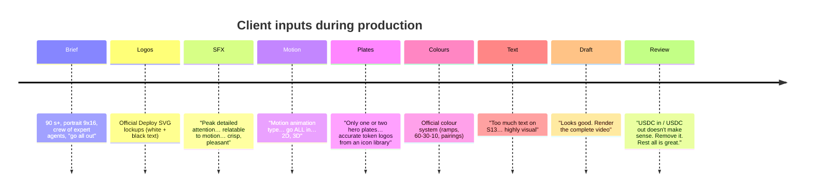

# 12 · Decisions and learnings

## 1. Decision log

| # | Decision | Options considered | Chosen, and why |
|---|---|---|---|
| D1 | Core concept | "Speed/AI power", "Profit", **"Both sides"** | The market data (both sides liquidated) and the product's own line ("trading both sides for you") point the same way. Positioning follows from evidence. |
| D2 | Visual law | Single look throughout; **dark market → light Deploy** | Gives the reveal a physical meaning, and Deploy's product UI (light) *is* the resolution |
| D3 | Rendering stack | After Effects-style generated video; **Remotion + R3F code**; all-AI video | Code is exact with data, on-palette, frame-synced to VO and editable. AI video is reserved for texture. |
| D4 | Hero plates | 4–5 plates → **2 plates** (client) | Budget and control; plates only for the opening world and the reveal |
| D5 | Price data venue | Binance (blocked 451) → **Hyperliquid** | Superstar trades on Hyperliquid, so it's on-brand. Hyblock was used for liquidations (labelled "binance btc perps"). |
| D6 | Opening hook | $ liquidations / drawdown / **direction changes** | "It whipsaws" is visual: a line with a tick per flip, and a counter |
| D7 | The 91 → 89 correction | Keep 91 (already recorded) / **re-record** | Honesty over convenience. Closed candles only, and the pickup took 4 small takes. |
| D8 | Voice | 3 voices × 2 takes | **Signal** (calm authority, clean numbers) |
| D9 | Score | 3 takes | **Take A** (clean stop at 20 s, strong impact, clean groove) |
| D10 | Music key | Asked D minor, measured **C#** | Tuned all SFX to the measured key |
| D11 | Score edits | Time-stretch vs **bar-exact repeats/cuts** | Whole bars keep the grid: +4 bars at 49.98, −1 bar at 79.98 |
| D12 | Sound sync | Hand-spotting in a DAW vs **CUES exported from scene code** | Sync can't drift, and retiming a scene retimes its sound |
| D13 | SFX sources | All generated / all synth / **both** | Generated for organic (whooshes, impacts, mechanical), synth for tuned and sample-exact micro-UI |
| D14 | Crew split | One agent does all / **Director + parallel scene agents** | Shared system first, then parallel scenes in separate files |
| D15 | Text on screen | Explanatory captions → **labels ≤ 3 words** (client) | "Highly visual motion animation": the narrator explains and the screen shows objects |
| D16 | Tug-bar percentages in S08 | Keep (illustrative) / **remove** | Invented numbers read as conviction scores, and that's misleading |
| D17 | "Live" dot on the backtest card | Turquoise pulse / **static Blue dot** | A simulated backtest isn't live |
| D18 | S13 landing time | 90.83 s (off-beat) → **91.0 → 89.0 s** | Land on the beat *and* on the narrator's "Superstar" |
| D19 | USDC beat | Keep / clarify / **cut** (client) | Confusing without crypto context. Cut the picture, the VO line and one music bar together. |
| D20 | Film length | ≥90 s requirement | 99 s → **97 s** after the cut, still above the minimum |

## 2. Client feedback rounds

| Feedback | Response time | What changed |
|---|---|---|
| SFX priority | Immediately | `CUES` contract in every scene; synth bank; analysis-driven take selection; audibility QA |
| Motion priority | Immediately | Real-time 3D in 5 scenes |
| Plate cap + token accuracy | Immediately | 2 plates; icon libraries only |
| Colour system | Same session | `theme.ts` + docs rewritten; plates regraded (ground to #F6F6FF); all scenes re-checked |
| Less text | Same session | S13 stripped; directive to both designers; S01/S02/S03/S09 trimmed |
| Remove USDC | ~40 min incl. re-render | S12 shortened, L21 removed, L22 moved up, one bar cut, cues re-exported, remix, re-render |

## 3. Mistakes, and how they were fixed

| Area | Mistake / symptom | Root cause | Fix | Prevention |
|---|---|---|---|---|
| Data | Direction changes = 91 | Counted the still-open candle; flats inconsistent | Closed candles, flats ignored → 89; VO pickup | Write the counting rule before computing |
| Data | Hyblock rejected ms timestamps | API expects seconds | Use unix seconds | Put API gotchas in the brief |
| Data | Binance 451 | Geo-block from the container | Hyperliquid public API | Have a fallback source ready |
| Tooling | Remotion "could not find tsconfig" | Missing config | Copy tsconfig; `resolveJsonModule`, `noUnusedLocals:false` | Template project |
| Tooling | ffmpeg `drawtext` missing | imageio ffmpeg build | Label contact sheets with PIL (`tools/sheet.py`) | — |
| Tooling | ESM import ignored NODE_PATH | Script outside the project | Moved `stills.mjs` into `video/qa/` | Keep Node tools inside the project |
| 3D | Star too saturated | three.js sRGB → linear conversion | Raw sRGB `Vector3` uniforms | Always use flat shaders with raw colours for brand work |
| 3D | Star shape too spiky/cheap | Wrong polyhedron | Stellated dodecahedron + seams + `lift` | Prototype hero objects in a dev comp first |
| 3D | Logo face navy | `scale(1,-1,1)` flipped normals | `rotateX(Math.PI)` | — |
| 3D | S02 flat, small, overlapping | Hand-placed camera | `fitCamera()` auto-framing + push-in, frosted cards | Solve cameras from content bounds |
| Plates | Visible box around the plate | Grade ground #DDDDE7 ≠ #F6F6FF | Re-tuned neutral stops | Measure the plate ground after grading |
| Plates | Plate bars over the chart (S01) | Layering | Tilt-up reveal with a footage mask | — |
| Motion | Iris too fast | 20 f linear | 34 f `EASE.soft` | Review transitions at 3–4 frames |
| Motion | Star vanished on frame 0 of S05 | Inside a tiny clip | Draw above the flood while `f < 30` | Always check frame 0 and the last frame |
| Motion | StepHeader title didn't clear its row | Exit in % of its own height | Exit in px | Test exits in stills |
| Motion | S09 canvas over the text | Layer order | Reorder + mask band | — |
| Audio | Act I music inaudible | Sparse intro + global normalisation | +9 dB ride | Plot per-stem levels |
| Audio | Groove competed with VO | Fixed −6 dB duck too shallow | Dialogue-aware ducker (VO ≥ music + 9 dB) | — |
| Audio | Some SFX buried | Levels guessed | Audibility list; +3 dB on subtle kinds; +4 dB bus | Measure SFX-over-bed per cue |
| Audio | Harsh takes (iris_open_b 0.58) | Generated brightness | Harshness metric + `tame()` EQ | Analyse every take before use |
| Orchestration | Subagents cancelled by an interrupt couldn't be relaunched | Harness rule | Director took over their work | Keep briefs in files |
| Delivery | Chat upload failed (33.4 MiB > 30 MiB) | Platform limit | Git links; offer a chat-only re-encode | Plan a <30 MiB preview |
| Comms | Said "nothing changed" after a rejected command, but part of it had run | Didn't verify | Corrected the report to the client | Check file timestamps before reporting |

## 4. Rules of thumb

**Story**
1. Find the one fact about the world that makes the product necessary. Build the film on it.
2. Use the product's own lines as narration. They're pre-approved.
3. Every number gets a source, a window, a venue and a date. Simulated means labelled.
4. If a line needs context the viewer doesn't have, cut it (the USDC lesson).

**Picture**
5. Code for information, generated video for atmosphere. Two plates are plenty.
6. The design system is law: tokens, ramps, one accent per frame, approved pairings.
7. Numbers are the text. Labels ≤ 3 words. The screen shows *things*.
8. Always derive timings from VO words and bars. Never hard-code a guess when `wordF` exists.
9. Match cuts beat dissolves. End scene N in scene N+1's first frame.
10. Nothing static for more than ~0.5 s: drift, breathe, rotate.

**Sound**
11. Export sound cues from the animation code. Sync by construction.
12. Measure the music's key and tempo, tune all tonal SFX to it, and edit the music in whole bars.
13. Keep SFX out of 2–5 kHz. Measure harshness and EQ everything.
14. Let the sound carry data (pitch, pan, density, size).
15. Build a sonic signature and use it for the three most important moments.
16. Silence is the strongest effect. Plan two.
17. The voice sits ≥ 9 dB above the music. Measure it, don't guess.

**Process**
18. Freeze the shared system, then parallelise scenes.
19. Contact sheets at sync frames catch 90 % of problems in seconds.
20. Show the client a draft early. Full renders are 30+ minutes.
21. Commit small, push often, and never commit licensed fonts.
