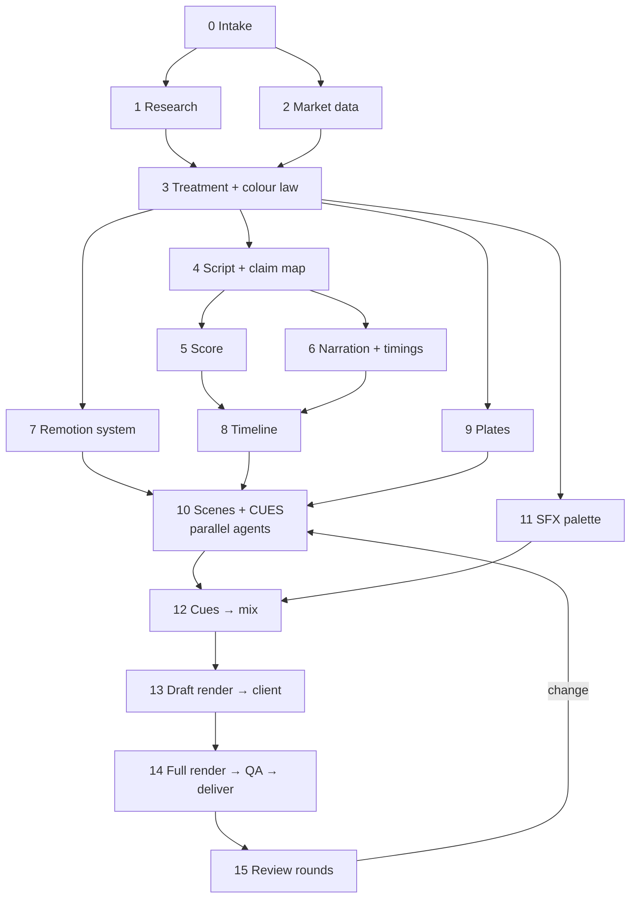

# 13 · Runbook: make the next film

A step-by-step checklist. Paths are relative to a project folder like `superstar/`. Commands assume the container used here: Node 20+, Python 3.11 with numpy/scipy/soundfile/pyloudnorm/imageio-ffmpeg/matplotlib/PIL, faster-whisper, and Chromium at `/opt/pw-browsers`.



## 0 · Intake (30 min)
- [ ] Record: product, audience, format (9:16?), minimum length, where it will run, deadline
- [ ] Ask for or collect: **official logo SVGs, colour system, fonts (and their licences)**, doc URLs, must-say and must-not-say lines
- [ ] Create a branch: `git checkout -b <product>-launch-video`
- [ ] Create the folders: `docs/ data/ assets/{brand,fonts,tokens} audio/src/{music,vo,sfx/el,sfx/synth} tools/ video/ deliverables/`

## 1 · Research (subagent)
- [ ] Send the researcher brief ([template in 11](11-prompt-library.md#brand--docs-researcher)) → `docs/00-product-and-brand.md`
- [ ] Gitignore commercial fonts **before** copying them: `printf 'Season*.woff2\n' > assets/fonts/.gitignore`

## 2 · Market data (subagent)
- [ ] Load the data MCP tools (e.g. Hyblock via ToolSearch). Pull from the product's own venue first (`tools/pull_market.py` pattern).
- [ ] Write counting rules. Produce `data/market.json` (with `asOf`) and `docs/03-quant-brief.md` (snapshot, regime, narrative, feature map, hooks, caveats).

## 3 · Treatment
- [ ] One idea, one visual law, three acts, a scene table with music sections → `docs/01-director-treatment.md`
- [ ] Colour law → `docs/02-color-system.md`, mirrored 1:1 in `video/src/theme.ts`
- [ ] Motion brief for scene builders → `docs/05-motion-brief.md` (project rules, design law, motion law, CUES contract)

## 4 · Script
- [ ] VO lines + on-screen words + **claim map** → `docs/04-script.md`
- [ ] Read aloud against the planned music hits and leave the hits clear

## 5 · Score
- [ ] `creative_create_flow` → one audio flow for everything
- [ ] Music v2 with a timestamped structure prompt ([template](11-prompt-library.md#score-prompt-template)), 3 takes
- [ ] Download, pick one, then measure tempo, downbeats and **key** (`tools/audio_analyze.py`, `tools/music_struct.py`)

## 6 · Narration
- [ ] `creative_list_voices` → shortlist 3 → full script × 2 takes each (`eleven_multilingual_v2`, ellipses for breaths)
- [ ] Pick a take. Get word stamps with faster-whisper (`small.en`, `word_timestamps=True`) → `*.words.json`
- [ ] Fill `LINES` in `tools/vo_plan.py` (source pieces + film start), add `WORD_OVERRIDES` where needed
- [ ] `python3 tools/vo_plan.py` → `audio/vo_plan.json`, `video/src/data/vo.json`
- [ ] Pickups for any corrected line: same voice, 3–4 takes, `LINE_SRC` + `LINE_GAIN_DB`

## 7 · Remotion system
```bash
cd video
npm i remotion@4.0.529 @remotion/cli@4.0.529 @remotion/renderer@4.0.529 @remotion/bundler@4.0.529 \
      @remotion/three@4.0.529 @remotion/fonts@4.0.529 @react-three/fiber@9.3.0 three@0.180.0 \
      react@19.1.1 react-dom@19.1.1 cryptocurrency-icons @web3icons/core
npm i -D typescript @types/react @types/three esbuild
```
- [ ] `remotion.config.ts` (browser executable, `swangle`, PNG, CRF 14, concurrency = cores)
- [ ] `theme.ts`, `anim.ts`, `fonts.ts`, `components/ui.tsx`, `Token.tsx` (+ `tools/extract_icons.mjs`), `data/logo.ts` from the official SVG
- [ ] `timeline.ts`: `SCENES` windows on bar lines, `DURATION`, `voF`, `wordF`, `local`
- [ ] `Root.tsx`: film + one composition per scene. `Film.tsx`: Sequences + grounds + `<Audio src={staticFile('audio/mix.wav')}>`
- [ ] `qa/stills.mjs`, `qa/cues.entry.ts`, and `"cues"` in package.json scripts

## 8 · Plates (optional, max 2)
- [ ] Plate prompt ([template](11-prompt-library.md#plate-prompt-template)) → `estimate_only: true` → generate
- [ ] `python3 tools/grade_plate.py raw.mp4 video/public/plates/p1.mp4 dark|light` (grade + 24→60 fps)
- [ ] Check that the graded ground equals the film ground (sample pixels)

## 9 · Scenes
- [ ] Director builds the concept-carrying scenes (open, reveal, signature moment, end card)
- [ ] Parallel agents build the rest from scene briefs ([template](11-prompt-library.md#scene-brief-template))
- [ ] Each scene: `T` from `wordF`, `CUES` from `T`, contact sheet, checklist ([07 §7](07-motion-design-remotion.md#7-scene-build-workflow))
- [ ] Director reviews sheets, fixes small issues directly, checks joins in the film composition

## 10 · SFX palette
- [ ] ElevenLabs SFX: batch of cinematic sounds + batch of UI/mechanical sounds, 2 takes each ([prompts](11-prompt-library.md#sound-effects))
- [ ] Poll `creative_get_flow_run_status`, then download each URL with curl (map session id → name)
- [ ] `python3 tools/sfx_synth.py` (edit `NOTE` to the measured key's root, fifth and second)
- [ ] `python3 tools/sfx_analyze.py` → pick takes by harshness, onset and tail

## 11 · Mix
```bash
cd video && npm run cues && cd ..
python3 tools/mix_audio.py          # -> audio/mix/*.wav + video/public/audio/mix.wav
python3 tools/mix_report.py 0 <len> # -> audio/mix/report_*.png + lowest SFX-over-bed list
```
- [ ] Set `MUSIC['segments']` (bar-exact edits), `MUSIC_RIDES`, `VO_OVER`, `SFX_BUS_DB`, `DUR`
- [ ] Add a `B_<kind>` builder for any new cue kind (the log warns about missing builders)
- [ ] Check: VO − music ≥ 6 dB while talking; silences silent; no buried key cues; −14 LUFS / −1 dBTP

## 12 · Draft → client
```bash
cd video
npx remotion render src/index.ts <FilmId> out/draft.mp4 --frames=0-<n> --scale=0.5 --image-format=jpeg --jpeg-quality=85
```
- [ ] Send the draft (≤30 MiB for chat), collect notes

## 13 · Final render + QA + delivery
```bash
npx remotion render src/index.ts <FilmId> out/final.mp4 --audio-bitrate=320k
ffmpeg -i out/final.mp4 -af ebur128=peak=true -f null -     # I ≈ -14 LUFS, peak ≤ -1 dBTP (+AAC overshoot)
cp out/final.mp4 ../deliverables/<name>-9x16.mp4
git add -A && git commit -m "..." && git push -u origin <branch>
```
- [ ] Frame-grab sheet from the MP4 at ~20 timestamps and look at it
- [ ] Share raw and blob links

## 14 · Review changes (example: removing a beat)
1. Shorten the scene in `timeline.ts` and shift the following scenes and `DURATION`.
2. Remove the VO line in `vo_plan.py`, move later lines by the same amount, run `python3 tools/vo_plan.py`.
3. Cut the same number of **whole bars** from `MUSIC['segments']`.
4. Remove the scene's content and fix its exit; update `CUES`.
5. `npm run cues`, then `mix_audio.py`, then join stills at the new cut, then full render.
6. Update the docs (script, treatment, sound) and commit.
