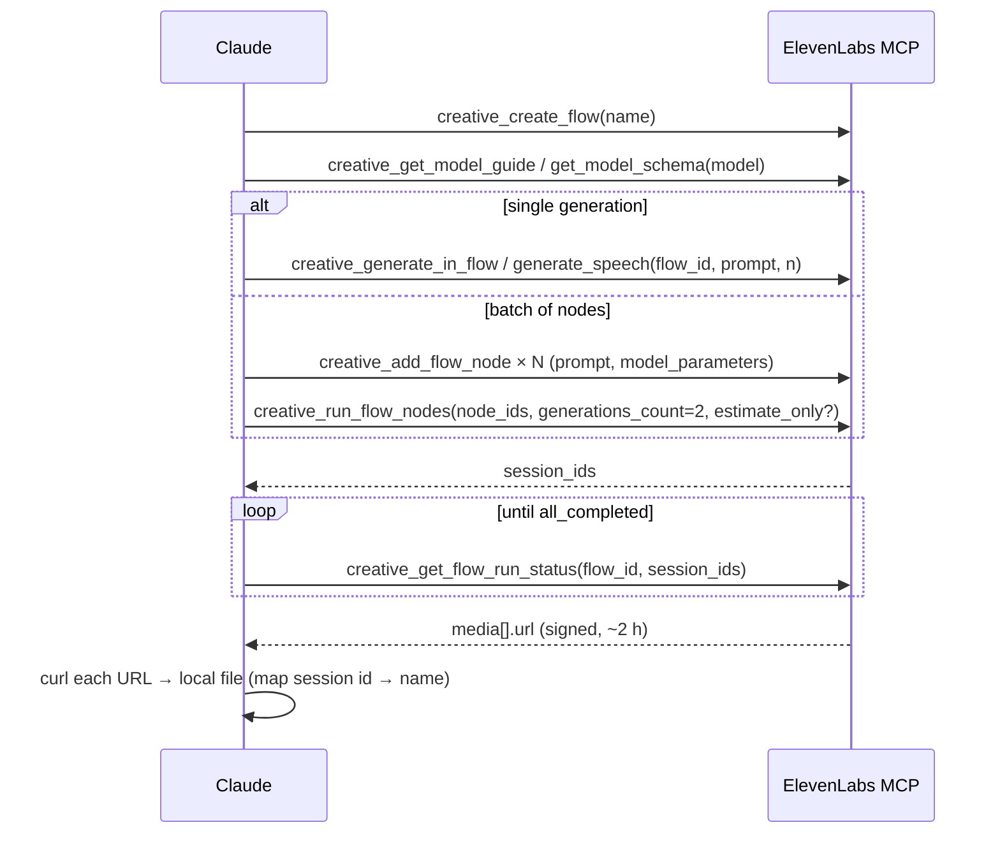
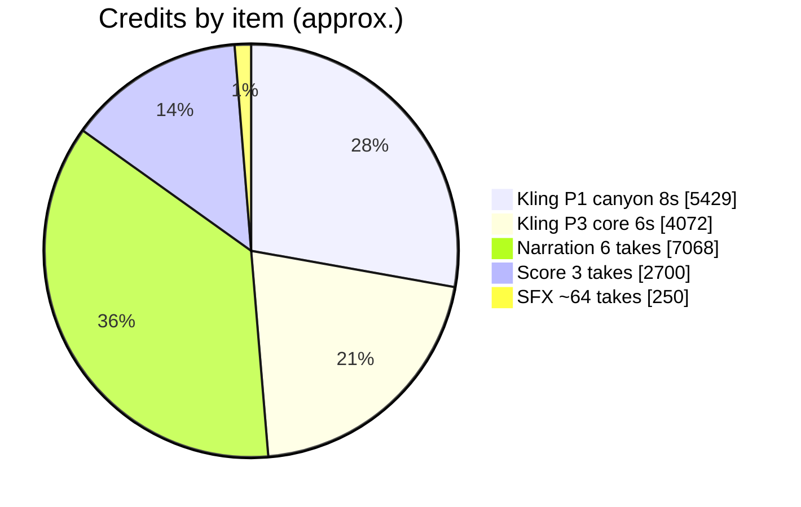

# 14 · Tools and resources

## 1. Services and models

| Service | Access | Model / endpoint | Used for |
|---|---|---|---|
| ElevenLabs Creative (MCP) | `mcp__ElevenLabs__creative_*` | `eleven_music_v2` | Score (3 takes) |
| | | `eleven_multilingual_v2` | Narration (6 takes + 4 pickups) |
| | | `eleven_text_to_sound_v2` | ~64 SFX takes |
| | | `kling-3-pro` (video-generation node) | 2 hero plates |
| | | `eleven_scribe_v1` | Transcription cross-check |
| Hyblock Capital (MCP) | `mcp__Hyblock__hyblock_*` | catalog, klines, liquidation, open_interest, funding_rate, positioning | Liquidations, OI, funding, positioning |
| Hyperliquid info API | `POST https://api.hyperliquid.xyz/info` | `candleSnapshot`, `fundingHistory`, `metaAndAssetCtxs` | Price series, funding, mark |
| Deploy docs + site | WebFetch / curl | docs.deploy.finance, deploy.finance | Claims, brand assets |
| GitHub | git over the session proxy | — | Branches, delivery |

**ElevenLabs MCP workflow**

Tips:
- Large status results get saved to a file. Parse them with `jq` (`.media[].url`, `.generations[].prompt`).
- Signed URLs expire after about 2 h, so download right away.
- Never re-run a generation just because a download failed. Poll the status again to get fresh URLs.
- Use `estimate_only: true` before expensive video nodes.

## 2. Software

| Tool | Version | Role |
|---|---|---|
| Remotion | 4.0.529 | Video framework (React), renderer |
| React / React DOM | 19.1.1 | UI |
| three / @react-three/fiber / @remotion/three | 0.180 / 9.3 / 4.0.529 | 3D |
| TypeScript | 5.9 | Types |
| esbuild | (bundled with Remotion) | Cue export bundle |
| Chromium headless shell | Playwright build 1194 at `/opt/pw-browsers` | Rendering (`swangle` CPU GL) |
| ffmpeg | via `imageio_ffmpeg.get_ffmpeg_exe()` | Decode, minterpolate, probes, ebur128 |
| Python | 3.11 + numpy, scipy, soundfile, pyloudnorm, matplotlib, Pillow | DSP, analysis, mix, reports, sheets |
| faster-whisper | `small.en` | Word timestamps |
| cryptocurrency-icons | 0.18.1 (CC0) | BTC, ETH, SOL, USDC icons |
| @web3icons/core | 4.x (MIT) | Hyperliquid (hyper-evm) mark |

## 3. Project tools (in `superstar/tools/` and `video/qa/`)

| File | Purpose | Run |
|---|---|---|
| `tools/pull_market.py` | Hyperliquid candles, funding, context → `data/hl_raw.json` | `python3 tools/pull_market.py` |
| `tools/audio_analyze.py` | decode, segments, onset envelope, tempo, RMS (library) | imported |
| `tools/music_struct.py` | Score structure / downbeats | `python3 tools/music_struct.py <mp3>` |
| `tools/vo_plan.py` | VO pieces → film times + word timings | `python3 tools/vo_plan.py` |
| `tools/grade_plate.py` | Chroma-aware palette grade + 24→60 fps | `python3 tools/grade_plate.py in out dark\|light` |
| `tools/extract_icons.mjs` | Copy token SVGs from icon libraries into `public/tokens` | `node tools/extract_icons.mjs` |
| `tools/sfx_synth.py` | Tuned synth SFX (library + bank writer) | `python3 tools/sfx_synth.py` |
| `tools/sfx_analyze.py` | Onset/peak/tail/centroid/harshness per take | `python3 tools/sfx_analyze.py` |
| `tools/mix_audio.py` | Full mix + master + stems | `python3 tools/mix_audio.py` |
| `tools/mix_report.py` | Stem levels, VO margin, spectrogram, audibility list | `python3 tools/mix_report.py 0 97` |
| `tools/sheet.py` | Labelled contact sheet from PNGs | used by stills.mjs |
| `tools/shot.js` | Playwright screenshot helper | — |
| `video/qa/stills.mjs` | Bundle once, render stills, contact sheet | `node qa/stills.mjs <Comp> <out> <frames> [scale] [cols]` |
| `video/qa/cues.entry.ts` | Collects every scene's `CUES` → `audio/cues.json` | `npm run cues` |

## 4. Assets

| Asset | Source | Licence / note |
|---|---|---|
| Deploy logo lockups (white/black text), mark #474DEF | Client-supplied SVGs | Brand-owned |
| Product imagery (three rules, trailing stop, equity, P&L by side, signal bus) | deploy.finance | Reference only; reinterpreted as motion |
| Season Sans / Season Serif | deploy.finance font files | **Commercial (Displaay). Local use only, gitignored.** |
| Geist Mono | Vercel | OFL |
| Fraunces / Inter | Google Fonts | Stand-ins if Season isn't available |
| Token icons | cryptocurrency-icons, @web3icons | CC0 / MIT |

## 5. Budget reference (ElevenLabs credits, approximate)

| Item | Approx. credits |
|---|---|
| Plates (2) | ~9,500 |
| Narration (6 full takes + pickups) | ~7,100 |
| Score (3 takes) | ~2,700 |
| SFX (~64 takes) | ~250 |
| **Total** | **~19,500** |

Compute on a 4 vCPU / 16 GB container: a full 97 s 1080×1920 render takes about 30 minutes, and a mix about 40 seconds.
