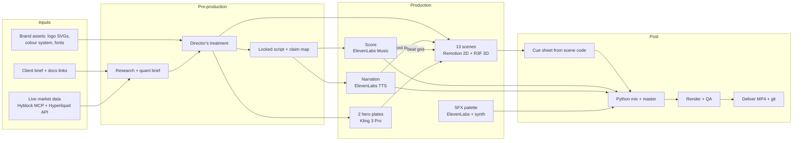

# Launch-film playbook: how the Superstar film was made

This folder documents the full process behind **Deploy Finance: Superstar launch film**, a 97 s, 9:16, 60 fps motion-design film with narration, score and frame-synced sound design. It covers who did what, which tools and data were used, every prompt, every step, every decision and what we'd do differently. It's written so a person or an AI crew can make another film like it from scratch.

> The film itself: `superstar/deliverables/superstar-launch-9x16.mp4` (1080×1920, 60 fps, H.264 + AAC 320k, −14 LUFS, −1 dBTP).

## What was made

| | |
|---|---|
| Format | 9:16 portrait, 1080×1920, 60 fps, 97.0 s (5,820 frames) |
| Picture | ~95 % code-driven motion design in Remotion (React), 2D + real-time 3D (React Three Fiber / three.js), plus **2 generated hero plates** (Kling 3 Pro), graded to the brand palette |
| Sound | ElevenLabs score (Music v2), ElevenLabs narration (Multilingual v2), ~40 ElevenLabs SFX takes plus a bank of Python-synthesised micro-SFX tuned to the score's key, all mixed in Python to −14 LUFS |
| Data | Live market data from the Hyblock MCP and Hyperliquid's public API. Every number on screen is sourced and dated. |
| Story | "This market punishes anyone who picks one side → Superstar trades both sides, and knows when to sit out." |
| Crew | One Director (lead agent) plus subagents: Quant Analyst, Brand/Docs Researcher, SFX Designer, two Motion Designers |

## Read in this order

| # | File | What's in it |
|---|---|---|
| 1 | [01-pipeline-overview.md](01-pipeline-overview.md) | The whole pipeline in diagrams: phases, dependencies, timeline, artefacts |
| 2 | [02-crew-and-orchestration.md](02-crew-and-orchestration.md) | The agent crew: roles, briefs, how work was split and handed back, what went wrong |
| 3 | [03-research-and-market-data.md](03-research-and-market-data.md) | Product/brand research, Hyblock + Hyperliquid data pulls, the quant brief, claims discipline |
| 4 | [04-creative-direction.md](04-creative-direction.md) | Concept, treatment, act structure, colour system, typography, motion laws |
| 5 | [05-script-and-voiceover.md](05-script-and-voiceover.md) | Script writing, claim map, voice casting, word-timing, pickups, placement on the timeline |
| 6 | [06-music.md](06-music.md) | Score brief, take selection, structure analysis, the edit to picture |
| 7 | [07-motion-design-remotion.md](07-motion-design-remotion.md) | The Remotion project: architecture, timeline, helpers, 2D and 3D techniques, scene recipes |
| 8 | [08-hero-plates.md](08-hero-plates.md) | Generated video plates: when to use them, prompts, grading to palette, retiming, handoff to 3D |
| 9 | [09-sound-design-and-mix.md](09-sound-design-and-mix.md) | Cue sheet, SFX palette (generated + synthesised), analysis, spotting, ducking, mastering |
| 10 | [10-qa-render-delivery.md](10-qa-render-delivery.md) | Contact sheets, stills, mix reports, render settings, delivery, git |
| 11 | [11-prompt-library.md](11-prompt-library.md) | **Every prompt used, verbatim**: agents, music, plates, voice, SFX. Plus templates |
| 12 | [12-decisions-and-learnings.md](12-decisions-and-learnings.md) | Decision log, client feedback rounds, mistakes and fixes, rules of thumb |
| 13 | [13-runbook.md](13-runbook.md) | Step-by-step checklist with commands to make the next film |
| 14 | [14-tools-and-resources.md](14-tools-and-resources.md) | Every tool, library, MCP, model, asset source and cost |

## The project in one picture



## Repository map (where everything lives)

```
superstar/
├── playbook/            ← this documentation
├── docs/                ← the film's own working docs (brand, treatment, colours, quant, script, motion brief, sound)
├── data/                ← raw + chart-ready market data (hl_raw.json, hyblock.json, market.json)
├── assets/
│   ├── brand/           ← official logo SVGs, product imagery
│   ├── fonts/           ← Geist Mono (+ Season fonts locally, gitignored: commercial licence)
│   └── tokens/          ← crypto icons from icon libraries
├── audio/
│   ├── src/music/       ← 3 score takes (A chosen)
│   ├── src/vo/          ← narration takes, pickups, Whisper word timings
│   ├── src/sfx/el/      ← ElevenLabs SFX takes
│   ├── src/sfx/synth/   ← synthesised, key-tuned micro-SFX
│   ├── cues.json        ← every motion cue on the film timeline (exported from scene code)
│   ├── vo_plan.json     ← narration pieces → film times
│   └── mix/             ← mix log, QA reports (WAVs gitignored)
├── tools/               ← Python/Node tooling (data pull, grading, VO plan, SFX synth, analysis, mix, reports)
├── video/               ← the Remotion project (src/, public/, qa/)
└── deliverables/        ← final MP4
```
